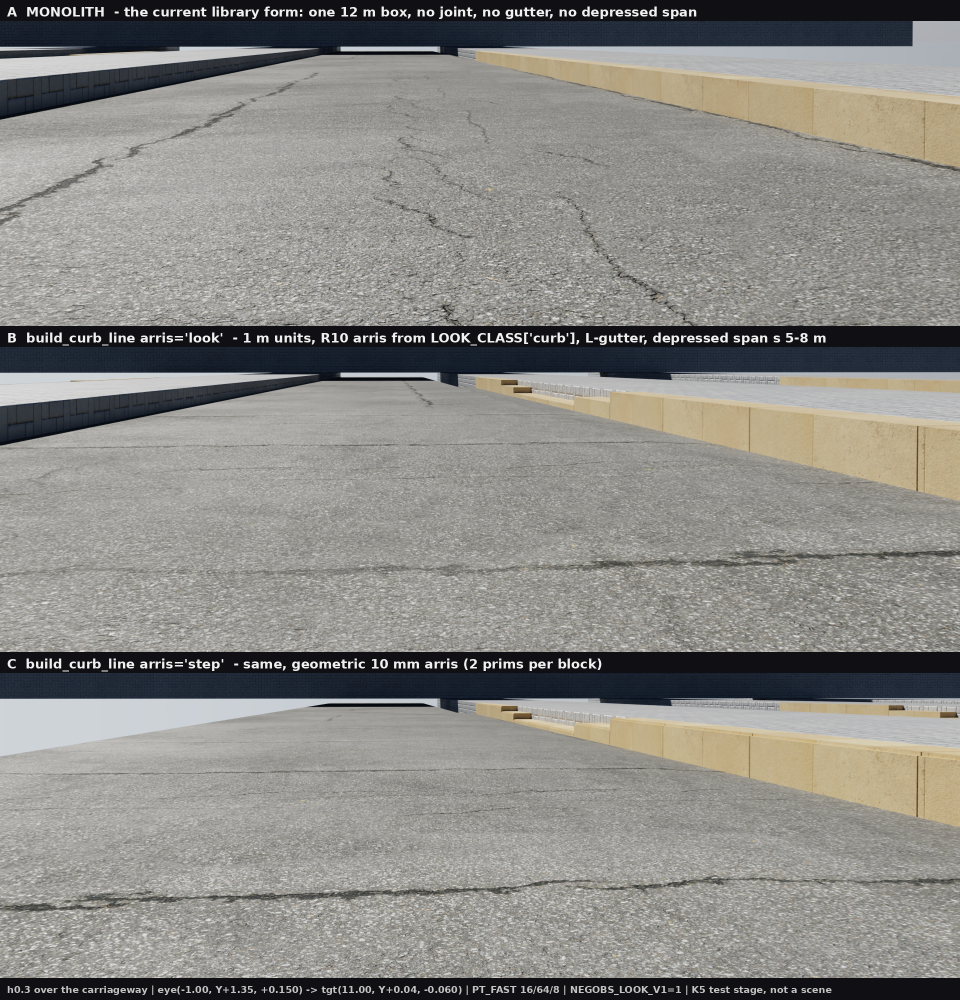
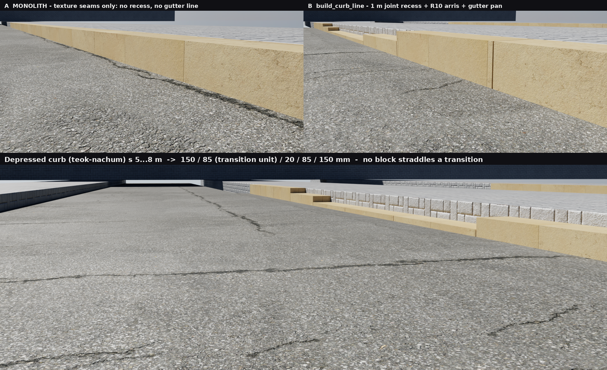

# W3 Lane 1d · K5 — `infra_kit` revival

**WP** K5 · infra kit  ·  **Owns** `/infra_kit.py` + `scenes/{main,batch1}/infra_kit.py` symlinks
**Authority** `w3_execution_spec_v1.md` §4.2 K5 row · §6.2-K5 · §9 S06-B · §10.2 P-10 · §10.7 §6.2-D ·
`w3_intake_v2_images.md` §4 Lane 1d · §7 rulings · `w3_intake_06_10.md` §3 S06-B ·
`w3_intake_01_05.md` §1 G-4 / §5 05-B
**Status** **LANDED** — five rows delivered, one row recorded-and-held by design, **no scene wired**.

---

## 0. Verdict

| Row (§4.2 K5) | Outcome |
|---|---|
| `build_curb_line` — new shared builder | **BUILT.** Unit-length blocks, R10 arris, L-gutter chaining, 턱낮춤 spans, LOD lever, polyline |
| `build_gutter_L` wiring | **DONE** as a chained call inside `build_curb_line(gutter=True)` (default), not a second hand-call |
| `build_ramp_curb` wiring | **ALREADY WIRED — the spec's premise was stale.** Corrected in the docstring; see §6 |
| manhole derivation helper (KDS rule) | **BUILT** — `derive_manholes` + `MANHOLE_INTERVAL_KDS` |
| RF-4 `TACTILE_YELLOW` worn-state constant *(prepared, HOLD)* | **RECORDED, NOTHING BUILT** — and the "nothing built" is now an AST assertion, not a promise |
| J-11 keep-at-zero docstring correction | **DONE** on both zero-locked callees + the adjudicated-KEEP note on the manhole flush draw |

**Geometry moved: zero.** `geom_invariance_check` output is **byte-identical** between an isolated
`HEAD` arm and `HEAD + this infra_kit.py` (§5.2). Nothing in the 33 scenes changes until a scene
owner calls the new builder.

---

## 1. VERIFY first — `infra_kit.py` already existed

The task carried an explicit instruction to check before creating. It exists (1,585 lines at HEAD,
written 2026-07-29) and already shipped seven builders: `build_gutter_L` · `gully_positions` ·
`build_gully` · `build_manhole` · `build_ramp_curb` · `build_road_marking` ·
`build_retaining_wall_details` · `build_tactile_pair`.

**Its consumers, all preserved:**

| Consumer | Call | Verified |
|---|---|---|
| `scene16_canopy_shadow.py:75, :921` | `ik.build_tactile_pair` (S16 lane's stair-head band) | SMOKE 631 prims, rc 0 |
| `scenes/batch1/sceneN4_downhill_ramp.py:843` | `import infra_kit as ik` | SMOKE 460 prims, rc 0 |
| `scene11_footbridge_stairs.py:189` | comment reference to `build_gully` geometry | SMOKE rc 0 |
| `ground_kit.py:1676 _ik_ramp_curb` | `ik.build_ramp_curb` → scene13 | see §6 |

**Every edit is additive or docstring-only.** No existing signature, default, return key or numeric
value was changed — the `build_tree` default-kwarg precedent, applied to a file with a live consumer.
The two symlinks `scenes/main/infra_kit.py` and `scenes/batch1/infra_kit.py` already exist and are
tracked; nothing to create.

---

## 2. `build_curb_line` — the S06-B builder

```python
build_curb_line(kit, path, p0, p1, mtl, height=0.150, width=0.20, unit=1.0,
                arris_r=0.010, gutter=True, drop_spans=(), …)
```

The five parameters the spec names appear in the spec's order with the spec's values. `p1=None`
accepts a **polyline** in `p0`, which reconciles the spec's own two readings (§9 gives a two-point
signature and then says *"along a polyline"*).

### 2.1 Unit-length blocks — the row's whole point

§6.2-K5: *"real 연석 is a 1 m unit product — the joint rhythm is the single strongest cue that it is
a curb and not paint."* The audit's counter-example is scene06: **one box 140 m long**; scene16 binds
`M["curb"]` with **no prim at all**.

- Cut boundaries are forced onto every segment end, span edge, taper edge and LOD edge; each interval
  is then split into `max(1, round(len/unit))` **equal** cells. This is the `_bay_joints` doctrine
  already in the file — divide first, split evenly, **never leave an offcut fragment**.
- The joint is a **6 mm gap**, not a prim, exactly as the gutter's joints are. A continuous **bedding
  core** (`bed=True`) sits *inside* the block footprint with its top 10 mm down, so the gap is a real
  recess instead of a see-through slot, and it is fully interior (55–95 % of the width, bottom raised
  5 mm) so there is no coplanar face and no z-fighting. One core prim per constant-height run.
- Measured: 12 m → 12 blocks × **1.000 m** + 1 core = 13 prims (**1.08 prims/m**); 140 m → 141.

### 2.2 Height rule

`height` is the exposure above the **carriageway datum**: 0.150 default, [0.100, 0.250] enforced.
With `walk_z` given, the curb top must sit **flush … +20 mm** over the footway. The self-check feeds
it scene02's actual numbers (`road −0.020`, `walk 0.000`, `curb_top +0.100`) and the builder
**raises** — the library's one outright shape error is now a test case. `strict=False` downgrades
both checks to returned warnings for a scene that means it.

`gutter=True` (default) chains `build_gutter_L` on the same line and folds its cross-fall into the
result: `gt_drop = height + drop_at_curb` = **0.150 + 0.018 = 0.168 m**. That is `build_gutter_L`'s
own GT note — *"placing this in front of a curb increases the curb exposure by the same amount →
recompute"* — discharged in code instead of left to the caller.

### 2.3 턱낮춤 (`drop_spans`)

`[(s0, s1)]` or `[(s0, s1, h)]` in arc length; `curb_s_at()` converts world coordinates. Over the span
the exposure drops to `drop_h` (≤ 20 mm enforced) and **one transition block per side takes the
mid-value**, which is what a graded 경사형 경계석 unit is. Measured on a 12 m run with a 5–8 m span:

```
150 150 150 150 | 85 | 20 20 20 | 85 | 150 150 150      (mm)
```

exactly three height values, i.e. **no block straddles a transition**. The row exists for scene06's
bollard row at `y = −9.30`, which has no corresponding drop.

### 2.4 Arris — and the hole it closes

`LOOK_CLASS["curb"]["bevel"] = 0.010` (MOLIT directive 321, fig. 2.17) is the repo's own mechanism for
the R10 arris, and it costs zero prims — so `arris="look"` is the default and the arris is a property
of the **material the scene binds**. That means a scene binding a `concrete` (20 mm) or `stone` (4 mm)
material silently gets the wrong arris. `check_arris_role(sc)` closes it without importing
`scene_common` (the `kit_from_scene_common` pattern: the caller passes the module object). Live in the
test stage: `LOOK_CLASS['curb'].bevel = 10.0 mm (required 10.0 mm) — OK`.

`arris="step"` is a 2-prim-per-block **square** step, tagged `[approximation]` — for a hero close-up or
a scene that cannot bind a curb-class material. `arris="none"` is a control arm only.

Material: the docstring routes callers to S06-B item 3's new **`curb_granite_light`** role and repeats
the prohibition on `granite_dark`. The test stage uses `marble_light` as a stand-in; **authoring the
role is an S-WP job, not K5's.**

### 2.5 Cost lever

`lod_span=(s_lo, s_hi)` segments at `unit` inside the judged window and at `far_unit` (8 m) outside.
Measured on 140 m with a 30 m window: **45 prims vs 141**.

---

## 3. `derive_manholes` — G-4

The defect, in the code's own words (`scene05_amphitheater.py:111-114`, `scene08:148-156`): the
manhole coordinate is *solved from the d5 frame occupancy*. Census: 26 sites / 19 scenes, 73 % inside
the d2/d5 near-window band, 11 at two magic x-values, `|y| ≤ 2.4` and `x < 0` in 26/26.

`derive_manholes(line, d_mm=450, junctions=…, grade_changes=…, size_changes=…)` returns
`[{x, y, s, reason, tag}]` from **triggers** (polyline vertex = 방향 변화, junction, 경사/관경 change,
upstream head) plus the KDS 61 40 00 straight-run interval (`MANHOLE_INTERVAL_KDS`: ≤600 → 75 m,
≤1000 → 100, ≤1500 → 150, ≥1650 → 200), evenly split so a long run has no offcut either. Triggers
within `merge_tol` (1 m) collapse to one chamber.

Verified against G-4's own worked example: scene05's declared line `[(-13.5,-3.0), (-2.0,-3.0)]`,
Ø450 → **exactly 1 manhole, at the upstream head (−13.5, −3.0)** — not at (−3.90, −0.40) on the camera
axis. A 16 m plaza run yields **0**.

**The function knows nothing about cameras, deliberately.** G-4 build-spec 1: the near-window
occupancy check *"may only reject a position, never produce one."* If a derived position lands in W1
over 25 %, the remedy is to adjust the preset or accept the occupancy **and record which** — not to
slide the manhole back.

---

## 4. Prepared, HOLD — and provably not built

`TACTILE_WORN_STATE` (§6.2-D) and `RF4_ADHERED_PAD` (P-10) are recorded with their numbers so the row
that unblocks them does not re-derive them. P-10's double block stands: tactile is default-OFF by user
decision (§12 do-not-touch 6), **and** at 12 mm proud GT-E1′ needs `EDGE_K(40) × 0.012 = 0.48 m`
against the statutory 0.30 m position, so it needs `GT-E2-x` / `EXPECTED_FP` registration in
`ground_kit` — **K1's file, not K5's. That is precisely why K5 may not build it.**

`_selfcheck` walks the AST and asserts that **no function in the file reads either name** (0 hits).
"Record the spec, build nothing" is now testable.

One deliberate omission: **no worn RGB is given.** §6.2-D describes a *mask* — grey concrete with
yellow surviving at edges and as ring outlines — not a colour, and a single invented RGB would be a
fabricated number. The dict records `centre = "bare host paving albedo — do NOT invent a colour
[no source]"` and points at sceneD4's shipped strip as the thing to measure when the row unblocks
(§12 do-not-touch 13 forbids cleaning it up).

---

## 5. Proof

### 5.1 Kit self-check — `python3 infra_kit.py`

**All items pass** (79 checks, 30 of them new). The new blocks:

- `[1b]` 12 blocks × 1.000 m · 11 joints · curb top = walk +5 mm · exposure 150 mm · face at kerb
  168.0 mm · arris look/curb/10 mm · 0 warnings
- `[1c]` depressed span 3+2 transition blocks · 3 distinct heights · 5 bedding runs · scene02 shape
  **rejected** · out-of-band exposure **rejected** · `strict=False` → 1 warning · LOD 45 vs 141 ·
  `arris='step'` +1 prim/block · polyline 16 m → 16 blocks · `curb_s_at` = 13.0 m
- `[1d]` scene05 → 1 head manhole · vertex trigger · 400 m Ø450 max gap 66.7 ≤ 75 m, uniform ·
  Ø1200 sparser · junction merge · 16 m plaza → 0
- `[1e]` both HOLD dicts referenced by **0 functions** · 3.5 mm < 6 mm · no invented colour ·
  RF-4 0.48 m > 0.30 m
- `[1f]` **all seven `build_curb_line` defaults equal their `INFRA_DIMENSIONS` ledger rows**, and the
  KDS interval table equals its four ledger rows — the file's own "no number outside the ledger" rule,
  now enforced instead of asserted

### 5.2 §6.1 floor — run in ISOLATED arms

`ground_kit.py`, `scene_common.py` and `scene16_canopy_shadow.py` were dirty in the shared tree
throughout this window (other lanes in flight) and commit `e4fc4cf` landed mid-window, so an unscoped
run over the working tree cannot attribute anything. Two `git archive HEAD` arms were built
(`k5_base`, `k5_arm`), differing **only** in `infra_kit.py`:

| Floor item | Result |
|---|---|
| `python3 -m py_compile infra_kit.py` | OK |
| `python3 scripts/geom_invariance_check.py` | base **33/33 PASS**, arm **33/33 PASS**, outputs **byte-identical** (`diff` empty) — R-4 and R-6 both green |
| `python3 scripts/placement_lint.py --scenes all` | base rc 1, arm rc 1, outputs **byte-identical** — the pre-existing violation set is unmoved. No new `jitter=` call site was introduced (the new builder has none) |
| `NEGOBS_SMOKE=1 python scenes/…` | `scene16` 631 prims rc 0 · `scene11` rc 0 · `sceneN4` 460 prims rc 0 — the three importers, run in the arm under `flock -w 7200 /tmp/negobs_gpu.lock` |

No scene file was touched, so there is no per-scene smoke beyond the importers.

Attribution note for the ledger: `sceneN5`'s geometry hash moved `6e5c4aea → 0ba41d96` during this
window. It is **not K5** — the base arm at `HEAD` already reads `0ba41d96`; the mover is commit
`e4fc4cf` (K4(0) leaf-off F1 fix). Recorded here so the next round stamp does not chase it.

### 5.3 GPU proof — test stage, h0.3

`k5_curb_stage.py` (scratchpad, not committed) — three 12 m 보차도 sections in one stage, identical
material, lighting and camera framing, run inside the GPU lock with `NEGOBS_LOOK_V1=1`,
`NEGOBS_DETAIL_SCALE=2`, `NEGOBS_DETAIL_ROUGH_GAIN=0`, PT_FAST 16/64/8:

| lane | arm | prims |
|---|---|---|
| y = −5 | **MONOLITH** — one 12 m box, no gutter, no joint, no drop (the scene06 form) | 1 |
| y = 0 | `build_curb_line` default (`arris="look"`) | 20 (12 blocks + 5 beds + gutter 3) |
| y = +5 | `build_curb_line(arris="step")` | 32 |

Eyes sit at **h0.3 over the carriageway** — the exposed 150 mm face looks at the road, so a footway
eye sees only the top; the road-side eye is the harder read and the correct one.





**What the frames show.** In B and C the 1 m joints are dark full-depth recesses that survive to the
vanishing point, the 150 mm face reads as a face (not a painted band), the gutter pan draws a second
line at the foot, and the depressed span is legible as a *shape* at 6 m. In A the same material at
the same distance produces only faint texture-tone breaks with no recess, no shadow line, no gutter
and no drop — which is exactly the "reads as paint" failure S06-B names. The `look` arris (B) and the
`step` arris (C) are indistinguishable beyond ~1 m, confirming that the zero-prim look route is the
right default and `step` is a close-up-only lever.

---

## 6. Handover — what scene owners must know

1. **`build_ramp_curb` is already wired. Do not wire it twice.** `w3_intake_06_10.md` §3 says it
   *"no scene calls"*; that is stale. The chain is `scene13:817 extras_args["ramp_curb"]` →
   `ground_kit.py:1801` profile `extras` → `ground_kit._ik_ramp_curb` (`:1676`) → `ik.build_ramp_curb`,
   and `_ik_ramp_curb` already registers the two elements **and** emits the `gt_changes` handover row.
   What scene13 still owes from S06-B item 5 is the **footway kerb** (`walk_north` / `walk_south`
   `proud=0.007` → a real 150 mm step), which is `build_curb_line`'s job, not this one.
2. **`build_curb_line` is GT-affecting.** `gt_drop = height + gutter cross-fall` (0.168 m by default),
   a continuous linear drop for the whole run; depressed spans are ≤ 20 mm and are **not** a drop. Any
   scene that calls it needs a GT re-cache and a ledger row appended **before** it lands (§0
   append-before-land). **K5 wired nothing, so K5 appends no ledger row.**
3. **Bind a curb-class material** and assert it with `check_arris_role(sc)`. S06-B item 3's
   `curb_granite_light` role has to be authored by the scene owners; `granite_dark` is forbidden.
4. **scene16's deferred curb is NOTED, not done** — per the K5 brief. 16 currently has *"colour without
   geometry"* (`M["curb"]` bound, no prim). That is one `build_curb_line` call for its owner (S2),
   at the scene's own `walk` top, and it is the cheapest of the eight consumers.
5. **Depressed spans are arc-length.** Use `curb_s_at(p0, p1, x, y)`; do not hand-convert.
6. Prim budget: **~1.08 prims/m**. Use `lod_span` on runs over ~40 m rather than raising `unit`, so the
   near window keeps the 1 m product rhythm.

---

## 7. Corrections this window found in the LAW documents

| Document | Claim | Correction |
|---|---|---|
| `w3_intake_06_10.md` §3 S06-B, `w3_execution_spec_v1.md` §9 | *"ships `build_ramp_curb` … that **no scene calls**"* | **Stale.** Wired through `ground_kit._ik_ramp_curb` since the W2 M4 batch (§6.1). Recorded in the function docstring so it is not "fixed" twice |
| `Docs/briefs/placement_rules_v1.yaml` `LINT-10.zero_locked_callees` | `where: "infra_kit.py:403"` / `"infra_kit.py:531"` | Line numbers shift with this commit. **Informational only** — `check_lint10_static` matches by callee *name*, and the lint output is byte-identical (§5.2). The YAML is **T1's file**; K5 did not edit it. **T1 follow-up: refresh the two `where` strings** |
| `w3_execution_spec_v1.md` §4.2 K5 row | "RF-4 `TACTILE_YELLOW` worn-state constant" | RF-4 (P-10, adhered pad) and §6.2-D (worn state) are **two different rows** that the K5 cell fuses. Both are recorded, as two separate dicts, both HOLD |

---

## 8. Open items — none blocking

- **`curb_granite_light` material role** is unauthored. Not K5's file (it is a per-scene `M[...]`
  entry). The builder documents the requirement and `check_arris_role` fails loudly if a scene binds
  the wrong class.
- **The 150/250/100 and flush…+20 numbers are project rulings, not statute.** They are ledgered as
  `사양` (spec), not `확인` (verified), with that fact stated in the ledger comment. Likewise the
  ≤ 20 mm 턱낮춤 value: `w3_intake_06_10.md` §3 item 4 calls it *"real Korean practice"* and cites no
  조문. If a statute cite is later obtained, only `INFRA_DIMENSIONS` changes.
- **`bed_frac`, `joint_w`, `drop_taper`** are `[추정]` — no domestic figure exists for a kerb joint
  width; the file's existing 옹벽 6–8 mm analogy is reused, the same analogy `gutter_groove_w`
  already carries.

---

**Files** `infra_kit.py` (+822 / −13) · `Docs/reports/w3_k5_v1.md` ·
`Docs/reports/w3_k5_curb_h03.png` · `Docs/reports/w3_k5_curb_macro.png`
**Not touched** any scene · `ground_kit.py` · `scene_common.py` · `Docs/audit_v4/gt_changes_w3.md` ·
`Docs/briefs/placement_rules_v1.yaml` · `scenes/main/scene18*` · `assets/coastal`
