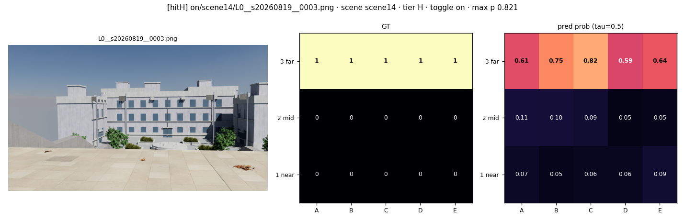

# 낙차(negative obstacle) 인지 — 진행 브리핑

2026-08-20 · 격자 `PROVISIONAL-GRID-V1` 전환 완료 · **①–④는 mainrun_0819(V0, 15칸) 산출물이고, ⑤ 본 표만 V1(20칸)·코퍼스 2832프레임 재훈련 결과다**

---

## ① 과제 한 줄과 증거 3티어

**단안 RGB 한 장에서, 낙차 픽셀이 화면에 보이지 않아도, 전방 지면의 낙차 위험을 극좌표 격자(5섹터 × 4밴드 = 20칸)로 예측한다.**

티어는 "낙차가 화면에 얼마나 찍혔는가"로 프레임을 가른 것이다 (● 카메라, ▔ 지면, ▁ 낙차 바닥, ▉ 가려진 부분):

```
V  ● ──시선──▶  ▔▔▔▔▔┐▁▁▁▁▁     낙차 안쪽 바닥이 화면에 찍힘        438장 (test 111)
E  ● ──시선──▶  ▔▔▔▔▔┐▉▉▉▉▉     테두리 선만 보이고 안쪽은 가려짐      36장 (test   9)
H  ● ──시선──▶  ▔▔▔▔▔▉▉▉▉▉▉     낙차 자체의 기여 픽셀 0(내부면·림 모두)   45장 (test  21)
```

※ "기여 픽셀 0"은 낙차 표면의 투영에 대한 **기하 술어**다. 두 팔의 이미지가 같다는 뜻이 아니다 — test H 96쌍 전부가 픽셀 단위로 다르다(중앙값 프레임의 4.51 %가 ≥32/255, 렌더러 노이즈 바닥의 1,872배).

V는 "보고 맞히기", **H는 "안 보이는데 맞히기"** — H가 이 연구가 겨누는 지점이다.

## ② 트윈 Δ — 맥락을 쓴다는 인과 증거

트윈 = 카메라 포즈·조명·소품을 바이트 단위로 고정한 채 **낙차 지오메트리만 제거한** 짝 프레임. 따라서 Δ는 상관이 아니라 개입(intervention)의 효과다.

| 티어 | 짝 수 | Δ = p(낙차 有) − p(낙차 無), 95% CI | CI가 0 배제 |
|---|---|---|---|
| V | 63 | 0.4062 [0.3242, 0.4885] | 예 |
| E ※ | 9 | 0.1891 | — |
| **H** ※ | **21** | **0.2398** | — |
| 전체 | 117 | 0.3476 [0.2859, 0.4103] | 예 |

※ E·H 행은 신뢰구간을 싣지 않는다. v1 test의 E는 1개 씬, H는 2개 씬(scene14·scene15)에서 나온다 — 프레임을 독립 단위로 본 부트스트랩은 클러스터 2개짜리 열거의 산물이다. 씬별 값을 그 씬의 off팔 FA와 나란히 싣는 것이 대체 보고 형식이다(scene14 rgb .278/.448/.558 · scene15 rgb −.010/.209/−.058).

RGB U-Net(seed 42), τ=0.5, 짝 단위 부트스트랩 10,000회. 원자료 `runs/rgb_s42/twin/twin_analysis.md`.

> **낙차 표면의 픽셀이 어느 팔에도 없는데 반응이 떨어진다 = "씬에 낙차가 있다는 사실"이 원인이라는 인과 증거.** 단 여기까지다 — 트윈은 *무엇이* 원인인지(그림자·간접광·함께 지워진 구조물·코퍼스 단서 규약 중 어느 것인지)를 가르지 못한다. 08-23 CUE-OFF 개입은 **재판정을 거쳤고(D50 · `weekend_0823/cue_audit/CUEOFF_RESULT_v2.md`), "모델이 단서 어휘에 반응한다"는 해석은 철회됐다.** 사전등록 1차 규칙의 판정은 30칸 전체에서 **CUE EVIDENCE 0**(SHORTCUT 2 · NO-EFFECT 6 · UNDECIDED 4 · VOID 18 — 판정 가능한 칸이 12개뿐)이고, 단서 전용 팔(arm C)의 FA는 **단서를 몇 개 남겼느냐가 아니라 그 팔의 수술이 그림을 광학적으로 얼마나 바꿨느냐**를 따라간다: 무위험 라운드 대비 화면의 58.4 % → FA 1.000 · 36.6 % → 1.000 · 13.1 % → 0.361 · **1.02 % → 0.042**이며, 맨 아래 scene17이 바로 **단서 어휘를 전부 유지한** 팔이다. 유일하게 큰 후보(scene20 수리 라운드 b2, 보정 **+0.506**, 3/3 시드)는 사전등록 기하-불변 규칙에 걸려 **VOID이고 승격하지 않았다**. → 현재 정확한 표현은 장치 중립적으로 **"낙차가 씬에 있다는 사실에는 조건부지만, 낙차 픽셀에도 특정 단서에도 조건부라고 말할 수 없다 — 씬 연합이지 단서 추론이 아니다"**.
> (장식 불변 대조군은 08-21에 실행됐고 결과는 더 강하다: N3에서 RGB는 **양쪽 팔 모두** 0.75–1.00의 프레임에서 평균 최대확률 0.74–0.95로 발화한다 — Δ≈0은 침묵이 아니라 **포화**다. Depth는 실제로 조용하고(0.000–0.125) B2는 혼재. 즉 널 대조군은 **장치는 통과, RGB 모델은 탈락**이며 이 사실은 팔 한정으로 서술해야 한다.)

## ③ H를 맞힌 장면 — scene14



scene14는 40단·총 6.0 m 낙차가 계단참만 보이게 설계되어 "평평한 테라스"로 읽히는 포템킨식 착시 대계단이다. 이 프레임의 낙차 기여 픽셀은 0장(H)인데 — 그렇다고 낙차 있음/없음 두 렌더가 같은 것은 아니다(scene14 잔차 중앙값 프레임의 7.57 %) — 모델은 5–12 m 밴드 한 줄(A3–E3)을 **max p 0.821** 로 켰다. H 히트 4장이 모두 같은 성격 — 먼 밴드 선행 반응.

## ④ v1 진단 한 장, 그리고 v2에서 고친 것


셀별 train 양성률(사전확률)과 낙차-OFF 프레임 오경보율의 관계. RGB는 **Spearman ρ = +0.963** (p = 5×10⁻⁶) — 오경보 지도가 라벨 사전확률의 축소 복사본이다. 먼 밴드의 사전확률 0.613이 상시 편향을 깔고, 그 위에서 특정 장면의 겉모습이 방아쇠를 당긴다(오경보 셀의 47.8%를 혼자 낸 sceneC2의 OFF팔 실제 최대 지면 낙차는 16 mm = 임계값 0.30 m의 5.5%, 즉 순수 환각). 근거리 밴드는 사전확률 0.082 · 오경보 0.000 · recall 0.000으로 사실상 비활성.

**그래서 v2에서:** ⓐ 먼 밴드 [5,12) m를 8 m에서 정확히 2분할해 **20칸**으로 — 편향과 증거가 한 칸에 섞이지 않게 ⓑ 폴라 헤드 최종 **bias를 셀별 train log-odds로 초기화** — 사전확률을 네트워크가 학습해 낼 필요를 없앰 ⓒ 체크포인트 선택 지표에 **val H recall** 포함 + H 보유 씬 하나를 val로 이동 — 선택기가 헤드라인 지표를 볼 수 있게 ⓓ **E/H 보강 렌더** — test H 21→약 40장, E 9→30장 이상.

## ⑤ 본 표 (V1 20칸 기준 · 2026-08-20 재훈련 결과)

τ = 0.5 (YOLO 행만 τ = 0.25, 검출기 관례). recall은 프레임 단위(정답 칸이 하나라도 켜지면 검출), FA는 낙차-OFF 프레임 중 아무 칸이나 켜진 비율. 각 칸은 seed 42/43/44의 **평균 ± 범위/2** — 이 폭은 **시드 산포이지 신뢰구간이 아니다**. 평가 집합: test 7씬 · V 180 · E 45 · H 96 · off 408 (코퍼스 2832프레임, `PROVISIONAL-GRID-V1`).

| 모델 | V recall | E recall | **H recall** | FA (off) ↓ |
|---|---|---|---|---|
| RGB U-Net | 0.796 ± 0.164 | 0.556 ± 0.378 | **0.688 ± 0.141** | 0.359 ± 0.127 |
| Depth U-Net | 0.917 ± 0.042 | 0.600 ± 0.000 | 0.438 ± 0.031 | **0.042 ± 0.029** |
| SegFormer-B2 | 0.730 ± 0.111 | 0.178 ± 0.267 | 0.229 ± 0.156 | 0.238 ± 0.143 |
| YOLOv8n | 0.150 ± 0.028 | **0.000 ± 0.000** † | **0.000 ± 0.000** † | 0.024 ± 0.018 |

> **H 열을 모델 간 비교로 읽지 말 것.** rgb 0.688은 FA 0.359에서, depth 0.438은 FA 0.042에서 읽은 값이다. FA를 맞추면 전 지점에서 Depth ≥ RGB(FA .10에서 .510 vs .326). 살아남는 주장은 더 약하고 충분한 쪽이다 — **"FA 10 % 예산에서도 단안 RGB가 은닉 티어 프레임의 1/3(0.326 ± 0.229)을 회수하며, 같은 티어에서 검출기 기준선의 트윈-조건부 회수율은 −0.010"**. 또한 RGB의 H 발화 중 44.7 %는 낙차를 지운 트윈에서도 발화한다(트윈-조건부 recall 0.688 → 0.375).
>
> † **YOLO의 E·H = 0은 우리 어댑터(`det2cell`)의 성질이다** — 검출 패러다임 일반의 상한이 아니다. GT 박스를 conf 1.0으로 넣은 오라클 천장도 E·H 0.000이므로, 이 0은 학습 이전에 이미 고정돼 있다. **어댑터를 제거하고 이미지 공간에서 직접 재면 0이 아니다**(H 프레임의 0.066이 amodal GT 박스와 IoU>0). 실제로 성립하는 더 강한 진술은 트윈-조건부 형태다: 같은 컷의 낙차 삭제 트윈에서의 값이 0.076이므로 **위험-조건부 회수율은 −0.010**(가시 티어는 +0.337). 즉 "amodal로 학습시킨 검출기조차 기여 픽셀 0 상황에서는 위험에 조건부인 증거를 전혀 만들지 못한다"가 논문에 쓸 문장이다. (`METRICS.md` §RT.3)
>
> **YOLO 행은 3시드로 확정됐다**(08-21, `SEED_TABLE.md` §4): V 0.150 ± 0.028 · E·H 0.000 ± 0.000(프레임·셀 양쪽, 3/3 시드) · off FA 0.005/0.025/0.042. aux 픽셀 손실 ablation도 완료됐으나 **부록 전용**이며 유의 주장은 철회됐다(§RT.5).
>
> **머리기사 한 줄:** RGB U-Net의 H recall이 v1의 **0.048–0.333**에서 v2의 **0.594–0.875**로 올라갔고, 1에폭 붕괴가 사라졌다 (best epoch 9/23/25/15/30). 무엇을 고쳐서 그렇게 됐는지는 ④에 그대로 있다. **단, 이 상승을 Depth 대비 우위로 읽어서는 안 된다** — 위 "H 열을 모델 간 비교로 읽지 말 것" 각주가 그 이유이며, FA를 맞추면 전 지점에서 Depth ≥ RGB다.
>
> **읽을 때의 정직한 주의 2개.** ⓐ test의 E 45장은 전부 `scene18` 한 씬, H 96장은 `scene14`+`scene15` 두 씬이다 — Depth의 E recall이 세 시드 모두 정확히 0.600인 것은 안정성이 아니라 분모가 한 씬이기 때문이다. ⓑ Depth의 H가 v1(0.714)보다 낮아진 것은 퇴보가 아니라 **test 구성 변화 100 %**다 — v1의 바로 그 21장 위에서 v2-Depth는 0.857로 v1-Depth를 이긴다. 확장된 75장이 원거리(`cam.d` 평균 8.57 m)이고, `d ≥ 9 m` 구간에서 Depth의 H recall은 3시드 모두 정확히 0.000이다. **"RGB 역전"이라는 표현은 쓰지 않는다** — 두 팔은 같은 τ에서 읽혔을 뿐 같은 운용점에서 읽힌 적이 없고, FA를 맞추면 역전은 사라진다(§RT.1).

> **참고 각주 — mainrun_0819의 V0(15칸) 수치.** 격자·분리·레시피가 모두 달라 위 표와 직접 비교할 수 없다.
> RGB U-Net V 0.667–0.721 · E 0.000–0.444 · H 0.048–0.333 · FA 0.143–0.274 (seed 42/43 **2개 씨앗의 범위**) ·
> Depth U-Net V 0.919 · E 0.333 · H 0.714 · FA 0.161 (seed 42 **단일 씨앗**) · SegFormer-B2 미학습 · YOLOv8n 신규 트랙.
> H·E가 씨앗 사이에서 크게 흔들린 원인은 val에 H 프레임이 0장이어서 체크포인트 선택이 헤드라인 지표를 못 본 데 있고, ④ⓒ가 정확히 그 지점을 겨눈다.

---

*출처: `experiments/mainrun_0819/{METRICS.md, RESULTS_DRAFT.md, runs/rgb_s42/twin/twin_analysis.md}` · `experiments/dayrun_0820/narrative/diag_v1/DIAG_V1.md`. 모든 수치는 시뮬레이션 전용이며 실측 평가는 아직 없다.*

**마감: 8/24 실험 동결 · 8/30 논문 제출.**
