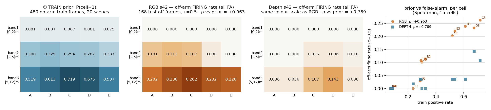
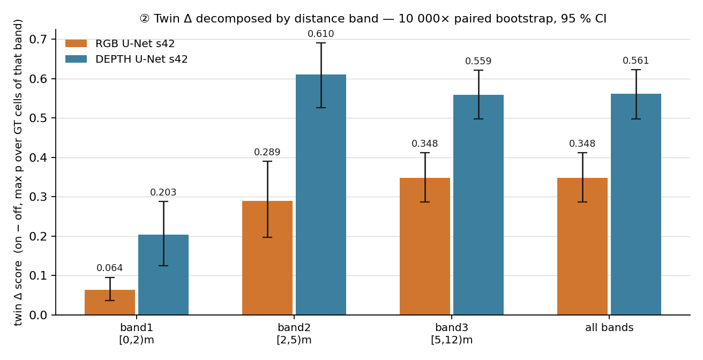
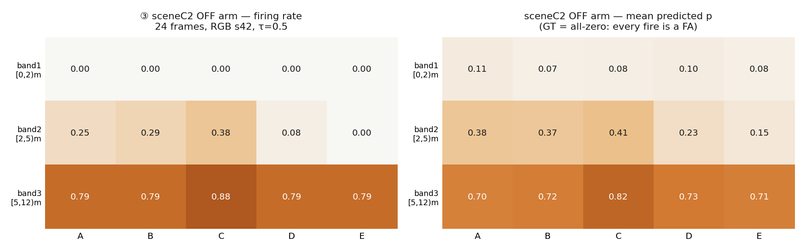
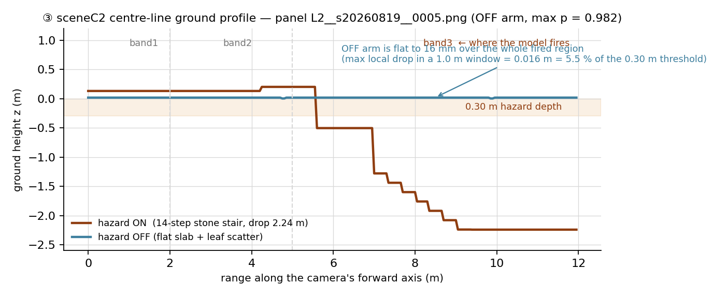

# DIAG v1 — the "before" evidence of the v1 → v2 development narrative

**Scope.** DAYRUN 0820 Phase 3. Three diagnostics computed on the **frozen `mainrun_0819`
artefacts** — grid `PROVISIONAL-GRID-V0` (15 cells = 5 sectors A–E × 3 bands
`1=[0,2) m · 2=[2,5) m · 3=[5,12) m`, cell index `band·5+sector`), split `split_v1.json`,
manifest `dataset_manifest_v1.json`, labels `annotations/labels_v0.json`, runs `rgb_s42`
and `depth_s42` at `τ_op = 0.5`. Nothing outside `experiments/dayrun_0820/narrative/diag_v1/`
was written. CPU only, `env_seg`, no scipy (Spearman implemented in-file).

**Why this page exists.** `METRICS.md` §8–9 left three unexplained observations: band 3 carries
almost all the recall, all four qualitative false-alarm panels are one scene (`sceneC2`), and
that same scene contributes **0** twin pairs. This page turns those three observations into
numbers so that the v2 recipe changes (grid V1 20-cell split of band 3, bias initialisation from
the train prior, E/H boost renders, split v2) have a measured "before" to be compared against.

**Reproduce.** `PYTHONNOUSERSITE=1 python diag_v1.py` (this directory) — writes the three PNGs
and `diag_v1_numbers.json`, which holds every number quoted below plus the per-frame tables.
Sanity gate inside the script: the recomputed all-band twin Δ reproduces `twin_pairs.csv`
`delta_score` to **max |dev| = 0.0000** on both arms, and matches `METRICS.md` §7
(RGB 0.3476 / Depth 0.5610). So the band decomposition below is the published statistic, split.

---

## ① Per-cell train prior vs off-arm false-alarm geography

*Figure 1 — Left: `P(cell = 1)` over the **480 hazard-on frames of the 20 train scenes**, from
`dataset_manifest_v1.json` `polar_gt` (gated labels, the ones the models were trained on).
Middle / right: **predicted-positive rate per cell on the 168 hazard-OFF test frames** at
τ = 0.5, i.e. pure false alarms — off frames carry zero GT-positive cells by construction, so
every coloured square is an error. Depth shares RGB's colour scale so the two are directly
comparable. Right-most: the same 15 cells as a scatter, one point per cell, with the Spearman
rank correlation between train prior and off-arm firing rate.*

### 1.1 Tables (3 × 5, sector A = image-left)

**TRAIN positive rate `P(cell=1)` — 480 on-arm frames, 20 scenes**

| band | A | B | C | D | E | band mean |
|---|---|---|---|---|---|---|
| 3 · [5,12) m | 0.519 | 0.613 | **0.719** | 0.675 | 0.537 | **0.613** |
| 2 · [2,5) m | 0.300 | 0.325 | 0.294 | 0.287 | 0.237 | 0.289 |
| 1 · [0,2) m | 0.081 | 0.087 | 0.087 | 0.081 | 0.075 | 0.082 |

**RGB s42 — off-arm firing rate, 168 test off frames, τ = 0.5**

| band | A | B | C | D | E | band mean |
|---|---|---|---|---|---|---|
| 3 | 0.202 | 0.238 | **0.262** | 0.232 | 0.220 | **0.231** |
| 2 | 0.101 | 0.113 | 0.107 | 0.030 | 0.000 | 0.070 |
| 1 | 0.000 | 0.000 | 0.000 | 0.000 | 0.000 | 0.000 |

**Depth s42 — off-arm firing rate, same frames, τ = 0.5**

| band | A | B | C | D | E | band mean |
|---|---|---|---|---|---|---|
| 3 | 0.036 | 0.036 | 0.107 | **0.143** | 0.036 | 0.071 |
| 2 | 0.000 | 0.000 | 0.036 | 0.036 | 0.018 | 0.018 |
| 1 | 0.000 | 0.000 | 0.000 | 0.000 | 0.000 | 0.000 |

### 1.2 The question, answered numerically

> *Does band 3 carry a high prior **and** high off-arm firing — i.e. prior-driven behaviour?*

**Yes, on both counts, and the coupling is nearly rank-perfect for RGB.**

| statistic | RGB s42 | Depth s42 |
|---|---|---|
| **Spearman ρ (train prior ↔ off-arm FA rate), 15 cells** | **+0.9626** | **+0.7889** |
| permutation p (200 000 shuffles, own impl., seed 42) | 5.0 × 10⁻⁶ | 9.9 × 10⁻⁴ |
| Pearson r (same vectors) | +0.9687 | +0.8118 |
| OLS slope FA = a·prior + b | a = 0.438, b = −0.043 | a = 0.149, b = −0.019 |
| ρ with `sceneC2` off frames removed (144 frames) | **+0.9663** (p = 5.0 × 10⁻⁶) | +0.4162 (p = 0.122) |
| band-mean prior, band 3 / 2 / 1 | 0.613 / 0.289 / 0.082 (= 7.4 : 3.5 : 1) | (same labels) |
| band-mean off-arm FA, band 3 / 2 / 1 | 0.231 / 0.070 / **0.000** | 0.071 / 0.018 / **0.000** |
| FA rate ÷ prior, band 3 / band 2 | 0.377 / 0.243 | 0.117 / 0.062 |

Three readings:

1. **The RGB arm's false-alarm map is a rescaled copy of the label prior** (ρ = +0.963,
   p = 5 × 10⁻⁶). Where the training labels say "this cell is positive 72 % of the time"
   (`C3`), the model fires on 26 % of hazard-free frames; where they say 7.5 % (`E1`), it never
   fires at all. Band 1 has **zero** off-arm firing on both arms — the same band that has zero
   RGB recall (`METRICS.md` §8) — so the near band is not "hard", it is *inert*: the model has
   learned an almost-flat near-band bias and never crosses τ there in either direction.
2. **The coupling is super-linear in the prior, not proportional.** FA ÷ prior rises 0.243
   (band 2) → 0.377 (band 3) for RGB. A pure "predict the prior" model would show a constant
   ratio; the rise means the far band additionally accumulates whatever weak appearance cue the
   model *does* use, on top of the prior.
3. **This is an RGB property, and it survives dropping the worst scene.** Removing `sceneC2`
   (which alone supplies 47.8 % of RGB off-arm cell fires) leaves ρ = +0.966. For Depth the
   same removal collapses ρ to +0.416 (p = 0.12) — Depth's off-arm firing is not a prior copy,
   it is essentially two scenes' worth of geometry it cannot read.

### 1.3 Where the off-arm firing actually lives (per scene, 24 frames each)

| test off scene | RGB frame FA | RGB cell fires (share) | Depth frame FA | Depth cell fires (share) |
|---|---|---|---|---|
| `sceneC2` | **0.875** | 121 (**47.8 %**) | 0.500 | 51 (**68.0 %**) |
| `sceneN3` (hard negative) | 0.708 | 99 (39.1 %) | 0.250 | 9 (12.0 %) |
| `scene05` | 0.208 | 20 (7.9 %) | 0.000 | 0 |
| `scene18` | 0.125 | 13 (5.1 %) | 0.375 | 15 (20.0 %) |
| `scene07`, `scene14`, `scene15` | 0.000 | 0 | 0.000 | 0 |

**87 % of RGB's false alarms come from two scenes**: `sceneC2` (diagnosed in ③) and `sceneN3`
(the trompe-l'œil hard negative, whose whole purpose is to look like a drop). The headline
frame-FA of 0.274 is therefore not a diffuse background rate — it is two concentrated failures
riding on a far-band prior that makes them cheap.

---

## ② Twin Δ decomposed by distance band

*Figure 2 — `Δ = max p over the GT-positive cells of band b (hazard-ON frame) − max p over the
same cells (hazard-OFF twin)`, over the **117 pose-matched kept pairs** of `twin_pairs.csv`
(pairs without a GT cell in that band are excluded, `n` below). Same camera pose, same
lighting, same seed — the only difference is the hazard geometry, so Δ > 0 means the prediction
is caused by the hazard rather than by the scene. Error bars = 95 % percentile CI from a
**10 000× paired bootstrap over the pair index** (`code/bootstrap.py`, seed 42), so the CI is on
the difference, not a difference of two CIs.*

| arm | band | n pairs | GT cells | Δ score [95 % CI] | CI excl. 0 | mean p ON | mean p OFF | Δ > 0 |
|---|---|---|---|---|---|---|---|---|
| RGB | 1 · [0,2) m | 24 | 102 | **0.0635** [0.0361, 0.0954] | yes | 0.099 | 0.036 | 24/24 |
| RGB | 2 · [2,5) m | 45 | 186 | **0.2893** [0.1963, 0.3896] | yes | 0.338 | 0.049 | 45/45 |
| RGB | 3 · [5,12) m | 93 | 372 | **0.3476** [0.2862, 0.4120] | yes | 0.564 | 0.216 | 88/93 |
| RGB | all | 93 | 660 | 0.3476 [0.2862, 0.4120] | yes | 0.564 | 0.216 | 88/93 |
| Depth | 1 | 24 | 102 | **0.2030** [0.1250, 0.2886] | yes | 0.261 | 0.058 | 21/24 |
| Depth | 2 | 45 | 186 | **0.6098** [0.5261, 0.6903] | yes | 0.684 | 0.074 | 42/45 |
| Depth | 3 | 93 | 372 | **0.5594** [0.4969, 0.6209] | yes | 0.685 | 0.126 | 90/93 |
| Depth | all | 93 | 660 | 0.5610 [0.4975, 0.6223] | yes | 0.694 | 0.133 | 90/93 |

*Why RGB's "band 3" row equals its "all bands" row exactly: the frame-level maximum over GT
cells lands in band 3 in **100 %** of RGB's 93 GT-carrying pairs (Depth: 87.1 %). The published
all-band twin Δ is, arithmetically, the band-3 twin Δ.*

### 2.1 Interpretation — the brief's hypothesis is **not** supported

The brief's test was: *if band-3 Δ is small relative to band 1/2, far-band firing is
prior/scene-shape rather than hazard evidence.* Measured, band 3 is the **largest** RGB Δ
(0.348), 5.5× band 1 (0.064) and 1.2× band 2 (0.289), with a CI that clears 0 by a wide margin.
So **on twin-matched pairs, far-band firing does track the hazard.** Removing a 0.3 m+ drop whose own surface
and rim project to zero pixels still costs the RGB model 0.35 of probability in band 3 — noting
that the removal also deletes everything the scene builder places in the same branch, and that the
two renders are not pixel-identical (§RT.6).

But the two diagnostics are measured on **disjoint frame sets**, and that is the finding:

- The twin evidence (②) comes from `scene05/07/14/15/18` — scenes whose off arm is a genuine
  appearance-preserving twin.
- The false-alarm mass (①) comes from `sceneC2` (0 twin pairs, all 24 excluded — see ③) and
  `sceneN3` (a hard negative with **zero GT cells**, therefore structurally absent from any
  Δ-over-GT-cells statistic; `METRICS.md` §7.1 records its RGB Δ_frame = 0.2521 against Depth's
  0.0001 — the RGB arm moves when the illusion *dressing* is removed, with no hazard present).

**Synthesis.** Band 3 is not "prior instead of evidence"; it is **evidence where the twin can
see it, prior where the twin cannot**. The far band is where the model has both the strongest
genuine hazard response *and* the highest standing bias, and the V0 grid cannot separate them
because band 3 spans 5–12 m as one cell row. This is the direct, measured argument for the
**grid V1 20-cell split of band 3 into [5,8) / [8,12)** and for **initialising the polar head's
bias from the per-cell train log-odds** rather than letting the network discover the prior:
both changes attack the bias half without touching the evidence half.

---

## ③ `sceneC2` decomposition — the scene behind 4/4 false-alarm panels

### 3.1 (a) What `sceneC2` is, and what the toggle actually removes

`scenes/batch1/sceneC2_leaf_stairs.py` — *"leaf-buried stone stair"*, an autumn park scene.
A **14-step stone stair** descends along +X from an upper dirt approach path
(riser 0.16 · tread 0.34 · **total drop 2.24 m**, run 4.76 m). A two-tier leaf layer **completely
buries the first 3 steps**: mound B's surface stands at **+0.084 m at x = 0**, a crest *above*
the approach plane, so the stair's start edge is geometrically erased from the sight line; steps
4–7 are filled at the centre only. The only surviving cue that the descent continues is **one
descending diagonal railing line**. It is the corpus's extreme case of *cue burial* — GT is
positive by geometry (drop 2.24 m ≫ 0.30 m threshold) while the visual evidence is deliberately
destroyed. Test split, 24 off-arm frames, light conds L2 / L3 / L7 (8 cams each).

The hazard key is **`hazard_stairs`** (`render_configs/sceneC2_on.json` = `{"hazard_stairs": true}`,
`sceneC2_off.json` = `{"hazard_stairs": false}`); the code comment on the key reads
*"False → stair·slope become z = 0 flat ground (geometry toggle)"*. Reading the assembly branch
(`sceneC2_leaf_stairs.py`, scene-assembly block):

| element | ON arm | OFF arm | note |
|---|---|---|---|
| 14-step stair + side slopes | built | **replaced by one flat slab at z ≈ 0** | `build_flat_fill` |
| **leaf burial mound** (3 sloped plates, the identity of the scene) | built | **removed** — `build_leaf_mound` sits *inside* the `hazard_stairs` branch | ✗ not appearance-preserving |
| railing (the one cue) | built | **removed** — `build_cues` likewise inside the branch | ✗ |
| **leaf scatter** (near-field leaves) | built | **built** — but placed on the *stair* terrain function, so every leaf at x > 0 sinks under the flat slab | leaves survive only on the approach, x ≤ 0 |
| autumn trees / hedges / ridge / ground kit | built | built — but the "lower" dressing is anchored to `Z_BOT = −2.24`, so in the flat arm it sits sunk | partially buried horizon |

**So: leaves remain (near field only, x ≤ 0, as flat scatter), the stair and the leaf mound and
the railing all disappear, and the far dressing sinks.** The off arm is *not* a hazard-free
version of the same picture; it is a materially different scene. That single fact explains both
of `sceneC2`'s anomalies (its false alarms in ① and its twin exclusion in (c)).

### 3.2 (b) The 24 off frames — which cells fire, and is there anything real to fire at?

*Figure 3 — `sceneC2` hazard-OFF arm only, RGB s42, τ = 0.5, 24 frames. GT is all-zero on every
one of these frames, so the left panel is a pure false-alarm rate and the right panel is the
model's mean confidence in a hazard that does not exist.*

**Firing table (RGB s42, 24 off frames, τ = 0.5)**

| cell | fires / 24 | firing rate | mean p | mean p when fired | max p |
|---|---|---|---|---|---|
| `A3` | 19 | 0.79 | 0.701 | 0.838 | 0.965 |
| `B3` | 19 | 0.79 | 0.716 | 0.853 | 0.978 |
| `C3` | **21** | **0.88** | **0.820** | **0.912** | **0.982** |
| `D3` | 19 | 0.79 | 0.731 | 0.861 | 0.976 |
| `E3` | 19 | 0.79 | 0.707 | 0.838 | 0.963 |
| `A2` | 6 | 0.25 | 0.375 | 0.737 | 0.776 |
| `B2` | 7 | 0.29 | 0.370 | 0.703 | 0.802 |
| `C2` | 9 | 0.38 | 0.409 | 0.683 | 0.790 |
| `D2` | 2 | 0.08 | 0.235 | 0.535 | 0.537 |
| `E2` | 0 | 0.00 | 0.148 | — | 0.404 |
| `A1`…`E1` | 0 | 0.00 | 0.072–0.113 | — | ≤ 0.209 |

**21 of 24 frames (87.5 %) raise at least one cell; the mean is 5.04 cells per frame**, and the
whole band-3 row fires together in most of them. The four `viz/fa_off_*` panels in `METRICS.md`
§9 (0.976–0.982 over 5–8 cells) are not outliers — they are the modal behaviour of this scene.

**Hypothesis test — is this 0.30 m severity confusion, or hallucination?**
The brief's hypothesis: a sub-0.30 m step / curb / leaf mound in the off arm reads as a drop.
Cross-checked against the **off-arm height map** (`dataset/260819_main_off/val/sceneC2/heightmap.npy`,
5 cm grid), restricted to the union of the wedges the model actually fired on (58 240 grid cells,
each frame's fired cells projected with the labeler's own `polar_cells` geometry and camera eye):

| measurement over the fired region | OFF arm | ON arm (same wedges) |
|---|---|---|
| walkable-ground height span | **[0.000, 0.0164] m** | — |
| **max local drop in a 1.0 m window** (the labeler's step-gate scale), ground samples only | **0.0164 m** | — |
| max local drop, all samples incl. vegetation | 1.224 m (a hedge/tree edge = a *positive* obstacle, 0.93 % of grid cells) | 3.287 m |
| max `z_off − z_on` in the same wedges | — | **2.258 m** (= the 2.24 m stair + the 0.018 m leaf layer) |
| height-map global z range | [0.000, 2.590] m (all ≥ 0) | [−2.242, 1.048] m |

*Figure 4 — ground height along the camera's forward axis for the strongest false-alarm panel
(`fa_off_01`, cut `L2__s20260819__0005.png`, max p = 0.982). The ON arm shows the leaf-mound
crest at +0.20 m, then the buried lip, then the 14-step descent to −2.24 m — all of it inside
band 3. The OFF arm is a straight line at +0.016 m from 0 to 12 m. The model fires on the blue
line at p = 0.982.*

**Verdict: the 0.30 m-severity-confusion hypothesis is refuted. This is hallucination, not a
real-but-sub-threshold feature.** There is no step, curb or mound in the off-arm walking
surface at all: the largest descent anywhere in the fired region is **16 mm = 5.5 % of the
0.30 m hazard threshold**, and it is the thickness of a leaf card lying on the slab, not a
step-down (`min z = 0.000` everywhere — the off arm's height map has no negative z anywhere in
the scene). The only >0.30 m relief inside the fired wedges is *upward* (partially sunk
dressing, ≤ 1.24 m), i.e. positive obstacles.

What the model is firing on is therefore **appearance context, not geometry**: an autumn dirt
approach path receding to a tree/hedge line, with leaf scatter in the near field — exactly the
appearance that in the ON arm co-occurs with a 2.24 m stair. Combined with ①, the mechanism is
compound: a far-band prior of 0.61 supplies the standing bias, and `sceneC2`'s surviving autumn
dressing supplies the scene-level trigger. `sceneN3` (39 % of the remaining fires) is the same
mechanism by design.

*Honest caveat for the paper:* because the C2 toggle also deletes the mound and the railing
(3.1), this frame set cannot be quoted as "identical image, hazard removed". It is evidence of
**scene-appearance shortcutting**, and it is a scene-construction defect to fix — the toggle
should move only the stair geometry, keeping `leaf_cover` dressing invariant.

### 3.3 (c) Why `sceneC2` contributes 0 twin pairs

`twin_analysis.py` keeps a pair only if `d, h_rel, yaw, pitch, ground_z` agree to 1 × 10⁻⁶.
Per-cut comparison of the manifest `cam` fields over all 24 `sceneC2` cuts:

| cam field | max |ON − OFF| | cuts exceeding tol |
|---|---|---|
| `d`, `h_rel`, `yaw`, `pitch`, `roll`, `hfov` | **0.0** | 0 / 24 |
| **`ground_z`** | **0.1137 m** | **24 / 24** |

`ground_z` alone, on **every** cut — confirming `METRICS.md` §7 ("all 51 exclusions are
`ground_z` mismatches; `sceneC2` 24"). The values are discrete: ON `ground_z ∈ {0.000 (12 cuts),
0.130 (12 cuts)}` vs OFF `∈ {0.0163, 0.0164}`. The two ON values are exactly the two surfaces
the camera can stand on in the ON arm — the bare approach path (0.000) and the **top of leaf
mound A** (0.130, matching its declared top face +0.06 → +0.13); the OFF value is the leaf
scatter card lying on the flat slab (0.0163). Because the eye is placed at `ground_z + h_rel`,
the two arms' cameras sit at absolute heights differing by **0.0164 m (12 cuts) or 0.1137 m
(12 cuts)** — the same `eye_z` spread the script measures directly (`−0.016 … +0.114 m`).

**Cause, in one line:** the C2 hazard toggle removes the leaf **burial mound** together with the
stair (§3.1), which changes the height of the ground *under the camera*, so the pose sampler's
ground reference — and hence the eye — moves between arms. It is not a camera-sampler re-draw:
`d/h_rel/yaw/pitch/roll/hfov` are byte-identical, only the ground datum shifted.

**Consequence, and the v2 lever.** The scene that dominates the off-arm false alarms is the
one scene absent from the causal (twin) analysis, so `METRICS.md` §7's clean Δ evidence and §9's
false-alarm evidence never meet. Two fixes, in order of preference: (i) **make the toggle
appearance-preserving** — move `build_leaf_mound` out of the `hazard_stairs` branch so the mound
and railing survive into the OFF arm (re-render required, and it makes C2 a *true* strict-H
twin); (ii) failing that, **relax the twin pose key to a tolerance on `ground_z`** (≤ 0.15 m
recovers all 24 C2 pairs and the 27 others) and report the height offset alongside — cheap, no
re-render, but the appearance difference remains a confound.

---

## Carry-over into v2 (what these three diagnostics buy)

| diagnostic | measured "before" | v2 change it justifies |
|---|---|---|
| ① ρ(prior, FA) = **+0.963** RGB, band-3 prior 0.613 vs band-1 0.082 | far-band standing bias is a rescaled label prior | grid V1 splits band 3 into [5,8)/[8,12); polar-head bias initialised to per-cell train log-odds; E/H boost render raises the far-band positive/negative balance |
| ② band-3 Δ **0.348 [0.286, 0.412]**, band-1 Δ 0.064, argmax in band 3 for 100 % of pairs | the far band carries *both* the real evidence and the bias; V0 cannot separate them | 20-cell grid + band-wise Δ reporting in the v2 table |
| ③ `sceneC2` off-arm max ground drop **0.0164 m** vs 21/24 frames firing at p ≈ 0.8–0.98; twin mismatch = `ground_z` only, 24/24 | confident hallucination driven by scene appearance; the scene is invisible to the twin test | appearance-preserving C2 toggle (or `ground_z` tolerance); the FA panel becomes a shortcut-sensitivity figure rather than an unexplained failure |

**Files in this directory** — `DIAG_V1.md` (this page) · `diag_v1.py` (reproduces everything) ·
`diag_v1_numbers.json` (all figures, per-frame tables) · `diag1_prior_vs_fa.png` ·
`diag2_twin_delta_bands.png` · `diag3_sceneC2_offarm_cells.png` · `diag3_sceneC2_profile.png`.
All numbers carry the `PROVISIONAL-GRID-V0` banner of `METRICS.md`.
