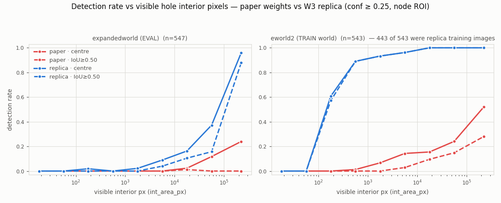
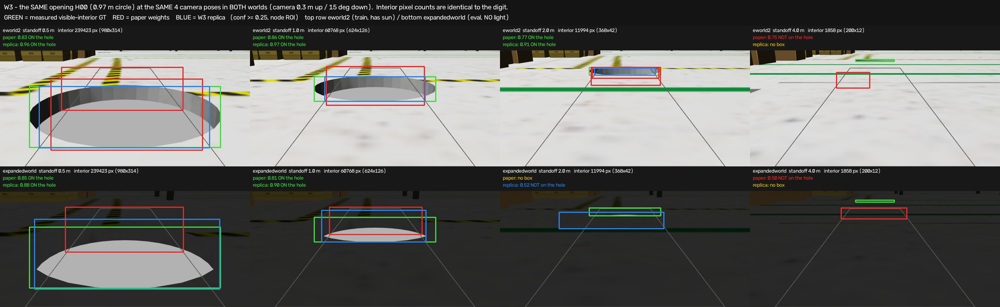

# VTH_REPORT — 구멍이 몇 픽셀 보여야 YOLO 가 잡나 (W3: 논문 가중치 vs 복제본)

2026-08-28 · 단계 **W3** · 브리프 `Docs/briefs/edge_relabel_brief_v6.md` §7 (창고 A트랙) · 범위는 **YOLO 검출 한계만**(주행·깊이 스트립·LiDAR 없음).
**원칙 P1: 문턱은 여기서 정하지 않는다.** 아래는 전부 "쟀다"이고 V/E 경계는 승용 결재.

## 1. 다섯 줄 요약

1. 논문 레시피 그대로(YOLOv8n·COCO 사전학습·100 epoch·batch 16·기본 증강·1클래스) `eworld2` 프레임 443장으로 **복제본을 학습**했다 — 118초, 100/100 완주, 월드 내 검증 mAP50 **0.915** (논문 자체 보고 0.935 와 근접).
2. 그런데 **평가 월드 `expandedworld` 547프레임에서는 검출률이 0.126** (중심 기준) / **0.079** (IoU≥0.50) 로 떨어진다. 논문 가중치는 같은 자리에서 **0.026 / 0.002**.
3. 학습에 안 쓴 `eworld2` 프레임 49장에서는 복제본이 **0.918** 이다. 즉 복제본은 학습 월드 안에서는 잘 하고, 월드를 넘으면 무너진다.
4. 무너지는 이유를 쟀다: 두 월드는 **개구부 270개가 전부 같은 구멍**이고(기하는 안 바뀜), 대신 **구멍/바닥 밝기 대비의 부호가 뒤집힌다** — `eworld2` 는 구멍이 바닥보다 **118 단계 어둡고**(99.3 % 프레임), `expandedworld` 는 오히려 **4.7 단계 밝다**(어두운 프레임 12.6 %). 일반화 실패가 아니라 **배운 단서가 반대로 뒤집힌 것**이다.
5. 그래서 "몇 픽셀이면 잡히나"의 답은 **어느 월드를 기준으로 읽느냐에 따라 500배 차이**가 난다 (검출률 0.50 도달점: 평가 월드 75,869 px vs 학습 월드 145 px). 이게 결재가 필요한 지점이다.

## 2. 그림 먼저

왼쪽 평가 월드 / 오른쪽 학습 월드, 빨강 = 논문 가중치, 파랑 = 복제본, 실선 = 중심 맞춤, 점선 = IoU≥0.50.

같은 개구부 H00 를 **똑같은 4개 카메라 포즈**에서 두 월드로 찍은 것. 보이는 속 픽셀 수가 자릿수까지 똑같다(239423 / 60768 / 11994 / 1858 px). 위=학습 월드(구멍이 검다), 아래=평가 월드(구멍이 밝다).

거리별 그림은 `plots/w3_p4_rate_vs_distance.png`, 논문 포즈만 추린 것은 `plots/w3_p5_paperpose.png`.

## 3. 교차표 — 검출률이 처음으로 그 수준에 닿는 지점 (**보고용, 결정 아님**)

`arm roi`(노드 정확 재현), conf ≥ 0.25. "never" = 이 데이터 범위에서 끝내 그 수준에 못 닿음.
| 월드 | 축 | 검출기 | 기준 | 0.25 | 0.50 | 0.75 | 0.90 |
|---|---|---|---|---:|---:|---:|---:|
| 평가 expandedworld | 속 넓이 px | 논문 | 중심 | never | never | never | never |
| 평가 expandedworld | 속 넓이 px | 복제본 | 중심 | **28,700** | **75,869** | 136,516 | 194,203 |
| 평가 expandedworld | 속 넓이 px | 복제본 | IoU.50 | 67,176 | 108,259 | 174,467 | never |
| 평가 expandedworld | 속 높이 px | 논문 | 중심 | 243 | 362 | never | never |
| 평가 expandedworld | 속 높이 px | 복제본 | 중심 | **95** | **151** | 236 | 305 |
| 평가 expandedworld | 속 폭 px | 논문 | 중심 | never | never | never | never |
| 평가 expandedworld | 속 폭 px | 복제본 | 중심 | **391** | **651** | never | never |
| 학습 eworld2 | 속 넓이 px | 논문 | 중심 | 58,868 | 202,559 | never | never |
| 학습 eworld2 | 속 넓이 px | 복제본 | 중심 | **91** | **145** | 318 | 730 |
| 학습 eworld2 | 속 높이 px | 복제본 | 중심 | 3.5 | 4.4 | 5.6 | 11.1 |

**한 번도 못 잡은 천장** (그 값 아래로는 검출 0건): 평가 월드에서 복제본 중심 기준 **220 px**(그 아래 87프레임), IoU 기준 **6,469 px**(349프레임). 논문 가중치는 **22,022 px**(442프레임).

## 4. 거리표 (카메라→구멍 중심, `dist_cam_to_hole_centre_m`, conf ≥ 0.25, 중심 기준)

| 거리 m | 평가 n | 평가 속 픽셀 중앙값 | 평가 논문 | 평가 복제본 | 학습 논문 | 학습 복제본 |
|---|---:|---:|---:|---:|---:|---:|
| 0–1 | 41 | 56,356 | 0.098 | **0.415** | 0.310 | 0.976 |
| 1–1.5 | 56 | 39,090 | 0.107 | **0.393** | 0.236 | 0.964 |
| 1.5–2 | 46 | 11,752 | 0.065 | 0.152 | 0.250 | 1.000 |
| 2–3 | 78 | 10,640 | 0.013 | 0.115 | 0.154 | 0.962 |
| 3–4 | 67 | 3,946 | 0.000 | 0.045 | 0.088 | 0.853 |
| 4–5 | 89 | 1,735 | 0.000 | 0.067 | 0.045 | 0.830 |
| 5–6.5 | 66 | 365 | 0.000 | 0.015 | 0.000 | 0.591 |
| 6.5–8 | 26 | 2,069 | 0.000 | 0.115 | 0.038 | 0.923 |
| 8–10 | 78 | 200 | 0.000 | 0.013 | 0.000 | 0.611 |

평가 월드에서는 **2 m 만 넘어가도 복제본조차 0.15 아래**로 떨어진다.
## 5. E 같은 프레임 (속이 하나도 안 보이는데 테두리 선은 보이는 프레임)

| 집합 | 속=0 프레임 | 그중 테두리 보임(E 후보) | 논문 박스 | 복제본 박스 |
|---|---:|---:|---|---|
| 평가 expandedworld | 27 | **27** | 2프레임 / 2박스 | 0 / 0 |
| 학습 eworld2 | 18 | **18** | 13프레임 / 21박스 | 1 / 1 |
| 가림 세트 | 62 | 4 | 0 / 0 | 1 / 1 |

GT 박스가 없으니 여기 나온 박스는 전부 오검출이다. **속이 0인 구간에서 YOLO 는 사실상 아무것도 주지 않는다.** 가림 세트(96프레임, 실제 에셋 11종, GT 있는 것 34프레임)는 **두 검출기 모두 모든 임계에서 정답 0건**이다. 곡선을 그릴 수 없고 숫자만 남긴다.

## 6. 덤 — 계단 씬으로 옮겨봤을 때 (전이 감각만, 판정 아님)

승용이 이미 본 5장(scene01/03/09/18 + scene18 L5)에 두 검출기를 그대로 돌렸다 (conf ≥ 0.25):

| 씬 | 낙하 마스크 픽셀 | 논문 박스 | 그중 낙하 위 | 논문 최고 conf | 복제본 박스 | 복제본 최고 conf |
|---|---:|---:|---:|---:|---:|---:|
| scene01 | 165,258 | 3 | **2** | 0.650 | 0 | 0.200 |
| scene03 | 152,033 | 0 | 0 | — | 0 | — |
| scene09 | 0 | 0 | 0 | — | 0 | — |
| scene18 | 769,172 | 2 | **1** | 0.872 | 0 | — |
| scene18 L5 | 0 | 0 | 0 | — | 0 | — |

논문 가중치는 계단 씬에서 가끔 낙하 위에 박스를 놓는데, **창고 한 월드만 본 복제본은 아예 침묵**한다. 그림 `VTH_smoke.jpg`.

## 7. 솔직한 한계

- **두 월드는 같은 구멍을 쓴다.** 판 메시가 같은 자리에 있어 개구부 270개가 전부 동일하고, 표적 7개 중 5개(H00·H30·H42·H60·H98)가 문자 그대로 같은 구멍이다. 월드 분할은 위험물이 아니라 **조명과 주변 물건만** 바꾼다 → 학습 월드 곡선은 일반화 성적이 아니다(543프레임 중 443장이 학습 이미지였다). 그래서 두 곡선을 나란히 실었다.
- **노출/조명.** `eworld2` 는 바닥이 자주 하얗게 날아가고(프레임 평균 183), `expandedworld` 는 광원이 아예 없다(평균 44). 그 결과가 §1-4 의 대비 부호 반전이다. 원본 월드는 손대지 않았다.
- **단일 시드**(seed 0, 신뢰구간 없음)이고 **정지 카메라**다 — 흔들림·모션블러·자동노출 없음. 논문 로봇의 실제 카메라 높이 0.125 m 는 브리프 포즈대(0.3–2.0 m) 밖이라 이 코퍼스에 아예 없다.
- **같은 프레임의 다른 구멍은 배경으로 학습**했다(단계 지시). 400 px² 넘는 비표적 개구부가 프레임당 약 1.5개 → 원거리 재현율이 그만큼 눌려 있다.
- **ROI 밖은 아예 없다.** GT 박스가 사다리꼴 밖이라 학습에서 빠진 `eworld2` 51장에서 두 검출기 모두 0.000 이다. 사다리꼴 자체가 문턱의 일부다.
- **가림 부분집합이 작다.** 96프레임 중 GT 있는 것 34장, 전부 0건 → "가림이 얼마면 못 본다"는 곡선은 못 만든다.

## 8. 결재란 (승용) — 후보만 올리고, 고르지 않았다

| 번호 | V/E 경계 후보 | 뒷받침 숫자 |
|---|---|---|
| ❗W3-A | **"한 번도 못 잡은 선"을 E 로**: 보이는 속 픽셀 **220 px 미만** | 평가 월드 547프레임 중 220 px 아래 **87프레임에서 두 검출기 검출 0건**. 논문 가중치만 보면 이 선이 22,022 px(442프레임)까지 올라간다 |
| ❗W3-B | **"실용 검출률 0.50"을 V 로**: 평가 월드 기준 **75,869 px** (높이 151 px · 폭 651 px) | 복제본 중심 기준 교차점. 논문 가중치는 이 축에서 0.50 에 **끝내 못 닿는다**. 거리로는 약 **1.5 m 이내** (0–1 m 0.415 / 1–1.5 m 0.393 / 1.5–2 m 0.152) |
| ❗W3-C | **기준 월드를 먼저 정해야 함** (❓W2-3·❓W3-1 과 한 몸) | 같은 0.50 지점이 학습 월드에서는 **145 px**(높이 4.4 px) — **500배 차이**. 학습 월드에서 안 쓴 49프레임 성적 0.918 vs 평가 월드 0.126 |

부속 문서: 상수·개방 항목 `VTH_CONST.md` (❓W3-1~3 추가) · 전체 표 `runs/w3_tables.md` · 그림 `plots/w3_p1…p6` · 접점 시트 `VTH_samples.jpg` · 계단 전이 `VTH_smoke.jpg`.
