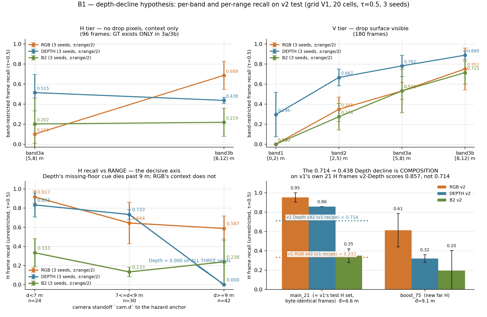
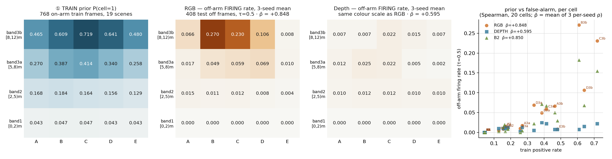
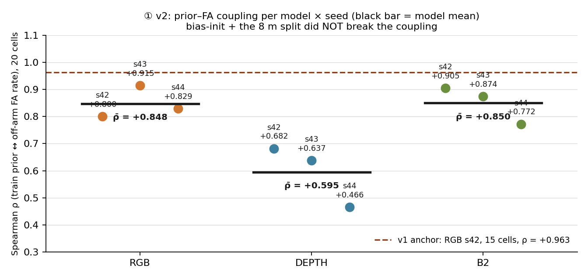
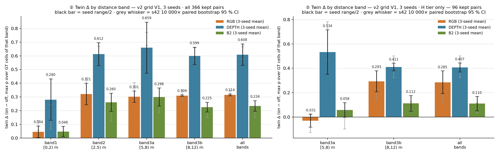
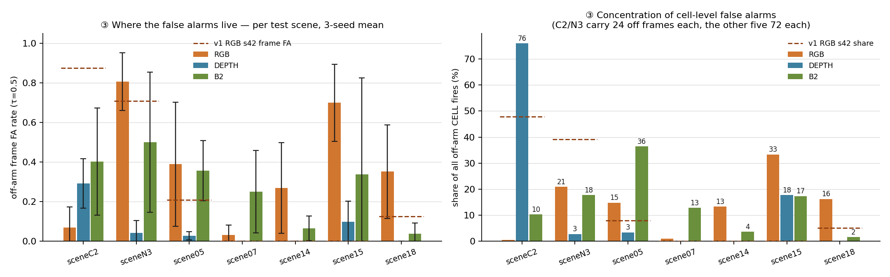

# DIAG v2 — the "after" evidence, on the same axes as `diag_v1`

**Scope.** NIGHTRUN 0820, tasks **B1** (§0) and **B2** (§1–§3) of `OVERNIGHT_BRIEF_0820_v1.md`.
All numbers recomputed on the **frozen `dayrun_0820` v2 artefacts**: grid `PROVISIONAL-GRID-V1`
(20 cells = 5 sectors A–E × 4 bands `1=[0,2) · 2=[2,5) · 3a=[5,8) · 3b=[8,12)` m, cell index
`band·5 + sector`), corpus `dataset_manifest_v2_full.json` (2832 frames), split
`split_v2_full.json` (train 19 / val 3 / **test 7 scenes, untouched**), 9 runs
`runs/v2/{rgb,depth,b2}_s{42,43,44}`, `τ_op = 0.5`.
Test set: **816 frames = 408 on (V 180 · E 45 · H 96 · H_weak 6 · none_in_fov 81) + 408 off.**
CPU only, `env_seg`, `PYTHONNOUSERSITE=1`, no scipy (Spearman implemented in-file, same code
path as `diag_v1.py`). **Nothing outside `experiments/nightrun_0820/narrative/diag_v2/` was
written** (the script sets `sys.dont_write_bytecode` so even `__pycache__` stays out of the
read-only trees).

**Reproduce.** `PYTHONNOUSERSITE=1 CUDA_VISIBLE_DEVICES="" python diag_v2.py` (this directory,
~35 s) — writes the five PNGs and `diag_v2_numbers.json`, which holds every number quoted below.

**Sanity gate (the same one v1 used).** The recomputed all-band twin Δ reproduces each run's
`twin/twin_pairs.csv` `delta_score` to **max |dev| = 0.0000 on all 9 runs**. The §2 seed means
reproduce `runs/v2/SEED_TABLE.md` §2 exactly (RGB 0.314 ± 0.007 / 0.285 ± 0.094 · Depth
0.608 ± 0.078 / 0.407 ± 0.037 · B2 0.234 ± 0.038 / 0.110 ± 0.059), and the §0 unrestricted
per-tier recalls reproduce SEED_TABLE §1. So the decompositions below are the published
statistics, split — not a second measurement.

---

## ⓪ B1 — the depth-decline hypothesis (DAYRUN ⑤(4))

*Figure 0 — Top row: **band-restricted frame recall** (a frame counts as detected in band `b`
if at least one of its GT-positive cells **in band b** crosses τ = 0.5), H tier left, V tier
right; markers are the 3-seed mean, whiskers the seed range/2. The H panel has only two points
because the v2 H set carries **zero GT cells in bands 1 and 2** (table 0.1). Bottom left: the
same H frames re-cut by **camera standoff `cam.d`** — the axis on which the effect is actually
monotone. Bottom right: H recall split by render round, against the two v1 anchors measured on
the **byte-identical** 21 frames.*

### 0.1 First: the premise. Is v2's H set far-dominated? — **yes, structurally**

| tier | n frames | frames with GT in band 1 / 2 / 3a / 3b | GT cells in 1 / 2 / 3a / 3b | `cam.d` mean (min–max) | render rounds |
|---|---|---|---|---|---|
| **H** | 96 | **0 / 0** / 33 / 96 | **0 / 0** / 126 / 345 | **8.57 m** (4.59–11.21) | main 21 · boost_h 39 · boost_e 36 |
| E | 45 | 0 / 3 / 24 / 45 | 0 / 15 / 117 / 216 | 8.16 m (4.69–11.24) | main 9 · boost_e 12 · boost_e2 24 |
| V | 180 | 27 / 90 / 156 / 180 | 117 / 363 / 627 / 759 | **4.99 m** (1.25–10.15) | main 111 · boost 69 |

This is stronger than "far-dominated": the v2 H set is **far-exclusive**. Every one of the 96 H
frames has a GT-positive cell in band 3b `[8,12)`; only 33 also reach into 3a `[5,8)`; **none**
reaches band 2 or band 1. 75 of the 96 come from the boost rounds, whose H cameras stand at
`d ∈ [6.74, 11.21]` m against the 21 original main-round H frames' `d̄ = 6.60` m. Consequence:
**H frame recall is arithmetically identical to band-3b frame recall in 8 of the 9 runs** — no H
frame is detected through band 3a alone, the single exception being B2 s43 (38/96 vs 35/96,
i.e. 3 frames caught only in 3a).

### 0.2 Band-restricted recall, 3-seed mean ± range/2, τ = 0.5

**H tier (96 frames) — frame recall / cell recall**

| band | RGB | Depth | B2 |
|---|---|---|---|
| 3a `[5,8)` m (n = 33 fr, 126 cells) | 0.101 ± 0.091 / 0.042 ± 0.032 | **0.515 ± 0.182** / **0.595 ± 0.202** | 0.202 ± 0.258 / 0.087 ± 0.115 |
| 3b `[8,12)` m (n = 96 fr, 345 cells) | **0.688 ± 0.141** / **0.454 ± 0.201** | 0.438 ± 0.031 / 0.516 ± 0.065 | 0.219 ± 0.141 / 0.100 ± 0.045 |
| **3b − 3a (frame)** | **+0.586** | **−0.078** | +0.017 |
| per-seed 3b − 3a (frame) | +0.473 / +0.875 / +0.412 | **−0.230 / −0.168 / +0.165** | +0.083 / −0.151 / +0.117 |

**V tier (180 frames) — frame recall / cell recall**

| band | RGB | Depth | B2 |
|---|---|---|---|
| 1 `[0,2)` (27 fr) | 0.000 ± 0.000 / 0.000 | 0.296 ± 0.222 / 0.188 ± 0.064 | 0.000 / 0.000 |
| 2 `[2,5)` (90 fr) | 0.348 ± 0.122 / 0.267 ± 0.101 | 0.667 ± 0.083 / 0.603 ± 0.033 | 0.274 ± 0.133 / 0.167 ± 0.074 |
| 3a `[5,8)` (156 fr) | 0.532 ± 0.083 / 0.356 ± 0.105 | 0.782 ± 0.106 / 0.734 ± 0.077 | 0.532 ± 0.218 / 0.310 ± 0.148 |
| 3b `[8,12)` (180 fr) | 0.752 ± 0.208 / 0.584 ± 0.186 | 0.889 ± 0.042 / 0.818 ± 0.067 | 0.715 ± 0.114 / 0.544 ± 0.177 |

### 0.3 The band label is the wrong range axis — camera standoff is the right one

The naive form of the hypothesis ("Depth band3b recall < band3a recall") is **seed-unstable**:
Depth's 3b − 3a is −0.230 / −0.168 / **+0.165**, i.e. one seed of three has the opposite sign.
Worse, the two bands are measured on **different frame sets** (33 vs 96 frames). Restricted to
the **33 H frames that carry GT in both bands**, Depth is *better* in the far band:

| within-frame, 33 H frames w/ GT in both bands | 3a frame / cell | 3b frame / cell | 3b − 3a (frame) |
|---|---|---|---|
| RGB | 0.101 / 0.042 | 0.899 / 0.602 | **+0.798** |
| Depth | 0.515 / 0.595 | 0.697 / 0.829 | **+0.182** |
| B2 | 0.202 / 0.087 | 0.333 / 0.165 | +0.131 |

So the 3a-vs-3b gap for Depth is a **frame-composition artefact of the unpaired comparison**,
not a range effect. The range effect is real, but it lives on `cam.d`:

**H frame recall (unrestricted) by camera standoff — 3-seed mean [per-seed]**

| standoff | n frames | RGB | Depth | B2 |
|---|---|---|---|---|
| `d < 7` m | 24 | 0.917 [0.875 / 1.000 / 0.875] | 0.833 [0.750 / 1.000 / 0.750] | 0.333 |
| `7 ≤ d < 9` m | 30 | 0.644 [0.500 / 0.933 / 0.500] | 0.733 [0.700 / 0.700 / 0.800] | 0.133 |
| **`d ≥ 9` m** | **42** | **0.587** [0.500 / 0.762 / 0.500] | **0.000 [0.000 / 0.000 / 0.000]** | 0.238 |

**Depth's H recall is exactly zero beyond a 9 m standoff, on all three seeds, on 42 frames.**
RGB loses 36 % of its near-H recall over the same span and then flattens. The arithmetic checks
out against the headline: (24·0.833 + 30·0.733 + 42·0)/96 = 0.438 = Depth's SEED_TABLE H recall.

### 0.4 The v1 → v2 Depth decline is composition, not regression

The 21 main-round H frames in v2's test are **byte-identical to v1's 21 test H frames**
(verified by frame-id set equality against `mainrun_0819/dataset_manifest_v1.json` +
`split_v1.json`). On that identical set:

| H frame recall on the **same 21 frames** | v1 recipe, s42 (`mainrun_0819/METRICS.md` §4) | v2 recipe, 3-seed mean ± range/2 | on the 75 **new** boost H frames |
|---|---|---|---|
| RGB | **0.3333** | **0.952 ± 0.048** | 0.613 ± 0.173 |
| Depth | **0.7143** | **0.857 ± 0.000** (18/21, all 3 seeds) | 0.320 ± 0.040 |
| B2 | — | 0.349 ± 0.071 | 0.196 ± 0.207 |

v2-Depth is **better** than v1-Depth on v1's own H frames (0.857 vs 0.714). The headline
`0.714 → 0.438` is therefore **100 % a change of test-set composition**, produced by adding 75
far H frames on which Depth scores 0.320.

### 0.5 The twin statistic agrees (H tier, band-restricted — see §2 for the full table)

| H-tier twin Δ, 3-seed mean ± range/2 (s42 point [95 % CI]) | band 3a `[5,8)`, n = 33 | band 3b `[8,12)`, n = 96 | direction with range |
|---|---|---|---|
| Depth | **+0.534 ± 0.183** (0.632 [0.472, 0.782], excl. 0) | +0.411 ± 0.031 (0.413 [0.324, 0.502], excl. 0) | **falls** |
| RGB | **−0.031 ± 0.054** (−0.049 [−0.127, **+0.017**], **∋ 0**) | +0.293 ± 0.087 (0.185 [0.138, 0.233], excl. 0) | **rises** |
| B2 | +0.058 ± 0.060 (−0.020 [−0.098, +0.044], **∋ 0**) | +0.112 ± 0.064 (0.090 [0.059, 0.124], excl. 0) | rises |

### 0.6 Verdict — **SUPPORT, with the range axis corrected**

> **Supported.** The premise is not merely true but structural: v2's H set carries **zero GT in
> bands 1–2**, sits at `d̄ = 8.57` m against V's 4.99 m, and is 75/96 boost-render frames — so
> "H recall" in v2 is, arithmetically, *far-band* H recall. On that set Depth's missing-floor
> signature does fade with range and then vanishes: H recall 0.833 → 0.733 → **0.000** across
> `d < 7` / `7–9` / `≥ 9` m (n = 24/30/42, unanimous over three seeds), and its H-tier twin Δ
> falls 0.534 → 0.411 from band 3a to 3b. RGB does *not* collapse: 0.917 → 0.644 → 0.587 over the
> same standoff bins, and its H-tier twin Δ *rises* (−0.031 → +0.293). The decisive control is
> that on the **byte-identical 21 H frames of v1's test set** v2-Depth scores **0.857**, above
> v1's 0.714 — so `0.714 → 0.438` is composition, not a model regression, and "Depth's drop" and
> "RGB's inversion" are indeed one phenomenon and not two. **Two corrections to how ⑤(4) framed
> it.** (i) The proposed test — "Depth band3b recall vs band2" — cannot be run at all (H has no
> band-2 GT), and its nearest runnable form, 3b vs 3a, **fails**: the −0.078 gap flips sign on
> seed 44, and on the 33 frames carrying GT in *both* bands Depth is *better* in 3b
> (0.697 vs 0.515). The range variable that works is camera standoff, not the band label.
> (ii) The "RGB context is relatively more useful at range" half is **confounded and only
> half-earned**: RGB's rise with range is the same monotone far-band gradient it shows on the V
> tier (0.000 / 0.348 / 0.532 / 0.752) and on hazard-**free** frames (§1: band FA 0.000 / 0.010 /
> 0.041 / 0.136, ρ̄ = +0.848 against the train prior), i.e. partly a standing bias rather than
> evidence. The part that *is* earned is the H-tier twin Δ of **+0.293 in band 3b** with a CI
> clear of zero — real hazard-caused far-band response — against **−0.031 in band 3a**, where
> RGB's H firing is **not** caused by the hazard at all. **The paper's H claim rests entirely on
> band 3b; it must not be stated for band 3a.**

---

## ① B2(i) — per-cell train prior vs off-arm false-alarm geography (v1 axis ①)

*Figure 1 — Left: `P(cell = 1)` over the **768 hazard-on frames of the 19 train scenes** of
`split_v2_full.json`, from `dataset_manifest_v2_full.json` `polar_gt` (gated labels — the ones
the models were trained on, and the vector the polar head's bias was initialised from). Middle /
right: **predicted-positive rate per cell on the 408 hazard-OFF test frames** at τ = 0.5,
averaged over the three seeds; off frames carry zero GT-positive cells by construction, so every
coloured square is an error. Depth shares RGB's colour scale. Right-most: the same 20 cells as a
scatter, one point per cell per model, with ρ̄ = the mean of the three per-seed Spearman ρ.
Same four-panel layout as `diag1_prior_vs_fa.png` (v1), one band row taller.*

*Figure 2 — the nine ρ values behind the question "did bias-init + the 8 m split break the
prior–FA coupling?", against v1's `+0.963` anchor (dashed). Black bar = model mean.*

### 1.1 Tables (4 × 5, sector A = image-left, far band on top)

**TRAIN positive rate `P(cell=1)` — 768 on-arm frames, 19 train scenes**

| band | A | B | C | D | E | band mean | v1 band mean |
|---|---|---|---|---|---|---|---|
| 3b · `[8,12)` m | 0.465 | 0.609 | **0.719** | 0.641 | 0.480 | **0.583** | *(v1 band 3 `[5,12)` = 0.613)* |
| 3a · `[5,8)` m | 0.270 | 0.387 | 0.414 | 0.340 | 0.258 | 0.334 | *(same row)* |
| 2 · `[2,5)` m | 0.168 | 0.184 | 0.164 | 0.156 | 0.129 | 0.160 | 0.289 |
| 1 · `[0,2)` m | 0.043 | 0.047 | 0.047 | 0.043 | 0.043 | 0.045 | 0.082 |

> The bias-init vector in each `config.json` (`train_positive_rate`) is **exactly half** of this
> row-for-row, because it is computed over train frames of *both* arms (1536 = 768 on + 768 off)
> while the table above is the on-arm prior. Ranks are identical, so nothing in §1 changes.
> Note the 8 m split did what it was meant to do at the label level: v1's single far row
> (prior 0.613) resolves into 3a = 0.334 and 3b = 0.583. It also **widened** the prior's dynamic
> range: v1 band 3 : 2 : 1 = 7.4 : 3.5 : 1, v2 3b : 3a : 2 : 1 = **13.1 : 7.5 : 3.6 : 1**.

**Off-arm firing rate, 408 test off frames, τ = 0.5, 3-seed mean**

| band | RGB (A…E) | RGB band mean | Depth band mean | B2 band mean |
|---|---|---|---|---|
| 3b | 0.066 · **0.270** · 0.230 · 0.106 · 0.008 | **0.136** | 0.012 | 0.097 |
| 3a | 0.017 · 0.049 · 0.059 · 0.069 · 0.010 | 0.041 | 0.013 | 0.033 |
| 2 | 0.015 · 0.011 · 0.012 · 0.008 · 0.004 | 0.010 | 0.011 | 0.009 |
| 1 | 0.000 · 0.000 · 0.000 · 0.000 · 0.000 | **0.000** | **0.000** | **0.000** |

**Band 1 fires on nothing, in every model, on every seed — v1's "inert near band" replicates
exactly at 20 cells** (and matches DAYRUN ⑤(2): RGB/B2 band-1 *recall* is also 0.000).

### 1.2 The nine ρ values — the answer to "did bias-init + the 8 m split break the coupling?"

| Spearman ρ (train prior ↔ off-arm FA rate, 20 cells) | s42 | s43 | s44 | **model mean** | permutation p range (200 000 shuffles, own impl., seed 42) |
|---|---|---|---|---|---|
| **RGB** | +0.800 | +0.915 | +0.829 | **+0.848** | 5.0 × 10⁻⁶ … 3.5 × 10⁻⁵ |
| **Depth** | +0.682 | +0.637 | +0.466 | **+0.595** | 8.7 × 10⁻⁴ … 4.0 × 10⁻² |
| **B2** | +0.905 | +0.874 | +0.772 | **+0.850** | 5.0 × 10⁻⁶ … 1.5 × 10⁻⁴ |

Auxiliary: ρ computed on the 3-seed-mean FA map is +0.891 (RGB) / +0.642 (Depth) / +0.888 (B2).
Dropping `sceneC2`'s 24 off frames leaves RGB and B2 **unchanged to 4 decimals** (the 20-cell
rank order is untouched); for Depth it drops +0.682 → +0.521 (s42) and +0.466 → +0.069 (s44),
and s43 becomes undefined because removing C2 leaves Depth s43 with **zero** off-arm fires.

### 1.3 v1 → v2, line by line

| statistic | v1 (15 cells, s42) | v2 (20 cells) | reading |
|---|---|---|---|
| ρ(prior, FA), RGB | **+0.9626** | **+0.848** (3-seed mean; range +0.800…+0.915) | **coupling survives** — weaker by ~0.11 ρ, still p ≤ 3.5 × 10⁻⁵ |
| ρ(prior, FA), Depth | +0.7889 | +0.595 (+0.466…+0.682) | survives, noisier; s44 is only p = 0.040 |
| ρ(prior, FA), B2 | *(not run)* | +0.850 | the transformer has the same coupling as RGB |
| **FA ÷ prior, far row** | 0.377 (band 3) | **0.234** (3b) · 0.122 (3a) | **magnitude coupling halved** |
| **FA ÷ prior, band 2** | 0.243 | **0.062** | cut by ~4× |
| band-1 FA | 0.000 | 0.000 | unchanged |
| RGB frame FA (off) | 0.274 (168 frames) | 0.359 ± 0.127 (408 frames); **0.387** on the *identical* 168 main-round off frames | FA went **up**, and not because of the new frames (§3.3) |

**Verdict on the coupling: NOT broken — de-magnified, not de-ranked.** Bias initialisation +
the 8 m split did not decouple the false-alarm geography from the label prior: the rank
correlation is still large and significant for all three models (RGB ρ̄ = +0.848,
p ≤ 3.5 × 10⁻⁵). What *did* change is the gain: the model now fires on far cells at **0.234× the
prior instead of 0.377×**, and on mid cells at 0.062× instead of 0.243×. Reading the two
together: giving the head the prior as a bias stopped it from *over*-expressing the prior, but it
still ranks its hazard-free firing by the prior — as it must, since the prior is a real
statement about where hazards live in this corpus. The honest development-narrative line for the
paper is therefore **"the far-band standing bias was reduced roughly two-fold, not removed"**,
and Figure 1 should be shown beside v1's Figure 1 with the FA÷prior ratio, not ρ, as the headline
number. The v1 story that the RGB FA map "is a rescaled copy of the label prior" still holds —
the rescaling factor just got smaller.

---

## ② B2(ii) — twin Δ decomposed by distance band (v1 axis ②, now 4 bands)

*Figure 3 — `Δ = max p over the GT-positive cells of band b (hazard-ON frame) − max p over the
same cells (hazard-OFF twin)`, over the **366 pose-matched kept pairs** of each run's
`twin/twin_pairs.csv` (408 pairs, 42 dropped, **all 42 for `ground_z` mismatch and all 42 from
`scene07`**; the kept set is byte-identical across all 9 runs since pairing is pose-only; 312 of
the 366 carry at least one GT-positive cell). Pairs without a GT cell in a band are excluded,
`n` in the table. Bars = 3-seed mean of the point estimate, black whisker = seed
range/2, grey whisker = the s42 **95 % percentile CI from a 10 000× paired bootstrap over the
pair index** (`mainrun_0819/code/bootstrap.py`, seed 42) — the CI is on the difference, not a
difference of two CIs. Left: all kept pairs. Right: the 96 H-tier pairs only.*

### 2.1 All 366 kept pairs

Each cell reads **`3-seed mean ± range/2` · `s42 point [95 % CI]`**. The seed mean and the s42
point are *different estimators* — the bootstrap CI is computed per run, so it brackets the s42
point, not the mean (v1 had one seed and so no such distinction).

| band | n pairs | GT cells | RGB | Depth | B2 |
|---|---|---|---|---|---|
| 1 · `[0,2)` m | 27 | 117 | 0.044 ± 0.042 · 0.088 [0.055, 0.128] | **0.280 ± 0.152** · 0.144 [0.065, 0.241] | 0.046 ± 0.038 · 0.016 [0.004, 0.032] |
| 2 · `[2,5)` m | 93 | 378 | 0.321 ± 0.079 · 0.367 [0.297, 0.439] | **0.612 ± 0.083** · 0.599 [0.529, 0.669] | 0.260 ± 0.067 · 0.173 [0.123, 0.227] |
| 3a · `[5,8)` m | 201 | 834 | 0.301 ± 0.041 · 0.350 [0.297, 0.403] | **0.659 ± 0.187** · 0.723 [0.674, 0.772] | 0.298 ± 0.066 · 0.236 [0.188, 0.287] |
| 3b · `[8,12)` m | 312 | 1263 | 0.309 ± 0.005 · 0.313 [0.277, 0.350] | **0.599 ± 0.064** · 0.614 [0.567, 0.658] | 0.225 ± 0.036 · 0.184 [0.150, 0.220] |
| **all bands** | 312 | 2592 | 0.314 ± 0.007 · 0.310 [0.274, 0.346] | 0.608 ± 0.078 · 0.621 [0.574, 0.665] | 0.234 ± 0.038 · 0.186 [0.150, 0.222] |

**Every band × model cell excludes 0 on the s42 bootstrap.** Argmax-band share (which band
carries the frame-level maximum): RGB 3b 84.3 % / 3a 12.2 %; Depth 3b 65.4 % / 3a 31.7 %;
B2 3b 72.8 % / 3a 26.0 %.

### 2.2 H tier only — 96 kept pairs (the headline-claim rows)

Same format: **`3-seed mean ± range/2` · `s42 point [95 % CI]`**.

| band | n pairs | GT cells | RGB | Depth | B2 |
|---|---|---|---|---|---|
| 3a · `[5,8)` m | 33 | 126 | **−0.031 ± 0.054** · −0.049 [−0.127, **+0.017**] **CI ∋ 0** | +0.534 ± 0.183 · 0.632 [0.472, 0.782] | +0.058 ± 0.060 · −0.020 [−0.098, **+0.044**] **CI ∋ 0** |
| 3b · `[8,12)` m | 96 | 345 | **+0.293 ± 0.087** · 0.185 [0.138, 0.233] | +0.411 ± 0.031 · 0.413 [0.324, 0.502] | +0.112 ± 0.064 · 0.090 [0.059, 0.124] |
| all bands | 96 | 471 | 0.285 ± 0.094 · 0.170 [0.124, 0.218] | 0.407 ± 0.037 · 0.413 [0.324, 0.502] | 0.110 ± 0.059 · 0.073 [0.034, 0.114] |

RGB s42 in band 3a on H frames: mean p ON = 0.243 vs mean p OFF = **0.292** — the off arm is
*higher*. 55 % of those 33 pairs have Δ > 0, i.e. a coin flip.

### 2.3 v1 → v2, line by line

| statistic | v1 (s42, 117 kept pairs, 3 bands) | v2 (3 seeds, 366 kept pairs, 4 bands) | reading |
|---|---|---|---|
| RGB band 3 Δ | **0.3476** [0.286, 0.412] | splits into 3a **0.301**, 3b **0.309** | the 8 m split shows the old far row was *homogeneous* for RGB — no near/far structure inside it |
| Depth band 3 Δ | 0.5594 | 3a **0.659**, 3b **0.599** | Depth's far row *does* have structure: −0.060 from 3a to 3b |
| RGB band 2 Δ | 0.2893 | 0.321 | slightly up |
| RGB band 1 Δ | 0.0635 [0.036, 0.095] | 0.044 ± 0.042 | still smallest, still > 0 |
| Depth band 1 Δ | 0.2030 | 0.280 ± 0.152 | up, and now the model with real band-1 recall (0.296) |
| "RGB's band-3 row **equals** its all-band row" | true — argmax in band 3 for **100 %** of pairs | argmax in band **3b for 84.3 %**, 3a 12.2 % | the split broke the degeneracy: all-band Δ is no longer arithmetically a single band's Δ |
| kept pairs / exclusions | 117 of 168; 51 dropped, all `ground_z`, of which **`sceneC2` = 24 (all of it)** | 366 of 408; 42 dropped, all `ground_z`, **all 42 from `scene07`**; **`sceneC2` contributes all 24 pairs** (D20 tolerance 0.15 m) | v1's §③ blind spot is closed — C2 is inside the causal analysis for the first time (its 24 pairs are all V tier). But see the B5 caveat: those pairs have a ≤ 0.15 m `ground_z` offset, so their two arms' inputs differ slightly |
| H-tier band Δ | not decomposable (v1 test H = 21) | RGB 3a **≈ 0**, 3b **+0.293** | **new**: the H claim is band-3b-only |

**Headline for §2.** The brief's v1 finding — "band 3 is evidence where the twin can see it,
prior where it cannot" — survives the split with one sharpening: for **RGB, on H frames, band 3a
is prior and band 3b is evidence**, and that boundary sits exactly where the new 8 m cut was
placed. For Depth, every band on every tier is evidence (all CIs clear of 0), which is the twin
counterpart of §0's finding that Depth's problem at range is *missed* hazards, not *invented*
ones.

---

## ③ B2(iii) — false-alarm scene decomposition, and the `sceneC2` recheck (v1 axis ③)

*Figure 4 — Left: **off-arm frame-FA rate per test scene** (fraction of a scene's hazard-OFF
frames on which at least one cell crosses τ = 0.5), 3-seed mean, whiskers = seed range/2; the
dashed brown rules are v1's RGB s42 values for the same scene. Right: each scene's **share of
the model's total off-arm cell fires**, with v1's RGB shares as dashed rules. Denominator
warning, drawn in the caption because it changes the reading: the boost renders added off frames
only to the five main test scenes, so `sceneC2` and `sceneN3` now carry **24 off frames each
against the other five scenes' 72** (v1: 24 each, evenly).*

### 3.1 Off-arm frame FA and cell-fire share per scene, 3-seed mean (408 off frames)

| test off scene | n off | RGB frame FA [per seed] | RGB cell-fire share | Depth frame FA | Depth share | B2 frame FA | B2 share |
|---|---|---|---|---|---|---|---|
| `scene15` | 72 | **0.699 ± 0.194** [0.889/0.500/0.708] | **33.4 %** | 0.097 ± 0.104 | 17.7 % | 0.338 ± 0.486 | 17.4 % |
| `sceneN3` (hard negative) | 24 | **0.806 ± 0.146** [1.000/0.708/0.708] | 20.9 % | 0.042 ± 0.062 | 2.8 % | 0.500 ± 0.354 | 17.8 % |
| `scene18` | 72 | 0.352 ± 0.236 | 16.2 % | **0.000 ± 0.000** | 0.0 % | 0.037 ± 0.056 | 1.6 % |
| `scene05` | 72 | 0.389 ± 0.312 | 14.8 % | 0.028 ± 0.021 | 3.4 % | 0.356 ± 0.153 | 36.4 % |
| `scene14` | 72 | 0.269 ± 0.229 | 13.3 % | **0.000 ± 0.000** | 0.0 % | 0.065 ± 0.062 | 3.6 % |
| `scene07` | 72 | 0.032 ± 0.049 | 1.0 % | **0.000 ± 0.000** | 0.0 % | 0.250 ± 0.208 | 12.9 % |
| **`sceneC2`** | 24 | **0.069 ± 0.104** [0.208/**0.000**/**0.000**] | **0.5 %** | **0.292 ± 0.125** | **76.1 %** | 0.403 ± 0.271 | 10.3 % |
| **all off** | 408 | **0.359 ± 0.127** | — | 0.042 ± 0.029 | — | 0.238 ± 0.143 | — |
| *v1 anchor, s42, 168 off* | *168* | *0.2738* (`METRICS.md` §4) | — | *0.1607* | — | — | — |

Corpus-level: RGB's off-arm frame FA went **up** 0.274 → 0.359 while Depth's went **down**
0.161 → 0.042 — a 3.8× improvement for Depth that the SEED_TABLE headline reports but does not
localise. §3.2 localises it: Depth's remaining FA is one scene.

### 3.2 The C2 recheck — **the concentration moved, and it moved off C2 for RGB**

| statistic | v1 (RGB s42, 168 off) | v2 (RGB, 3-seed mean, 408 off) | change |
|---|---|---|---|
| `sceneC2` frame FA | **0.875** (21/24 frames) | **0.069** — and **0.000 on two of three seeds** | **−0.806** |
| `sceneC2` cell fires | 121 (**47.8 %** of all fires) | 2.0 (**0.5 %**) | **−47.3 pp** |
| `sceneC2` fires **per off frame** (denominator-free) | 5.04 | **0.083** | **60× lower** |
| `sceneN3` cell-fire share | 39.1 % | **20.9 %** (rate-normalised: 40.5 %) | still top-2, no longer #2-of-two |
| **top-2 scene concentration** | **86.9 %** (C2 + N3) | **54.3 %** (scene15 + N3) | **de-concentrated by 33 pp** |
| scenes with **zero** RGB fires | 3 (`scene07/14/15`) | 0 | FA is now diffuse |
| **new #1 FA source** | `sceneC2` | **`scene15`** (33.4 % of fires, 0.699 frame FA) | **the dominant FA source changed identity** |

**For Depth the opposite happened.** `sceneC2` was 68.0 % of Depth's cell fires in v1 and is
**76.1 %** in v2 — with `scene18`, v1's #2 Depth FA source at 0.375 frame FA, now at **exactly
0.000 on all three seeds**. Depth's whole false-alarm budget (frame FA 0.042) is now essentially
one scene plus a little `scene15`.

**Answer to "is C2 still the dominant FA source at v2?"** — **For RGB: no, decisively.** C2 went
from supplying nearly half of all RGB false alarms to supplying 1 in 200, and two of the three
RGB seeds never fire on it at all; the v1 finding that "4/4 qualitative FA panels are one scene"
would not reproduce. **For Depth: yes, more than ever (76.1 %).** So the "confident C2
hallucination" caveat is now a **Depth-arm** caveat, not an RGB one — which inverts the way
`DIAG_V1.md` §③ and `METRICS.md` §9 frame it, and matters for how C2's re-render (track C2 of
the brief) is reported: the appearance-preserving off arm is now a control for *Depth*'s residual
FA and for RGB's *former* behaviour, not for RGB's current one.

### 3.3 Where the new false alarms came from — **not from the new frames**

| RGB off-arm frame FA | n off frames | 3-seed mean [per seed] |
|---|---|---|
| main round (`260819_main_off`) — **the identical 168 frames v1 measured** | 168 | **0.387** [0.429 / 0.482 / 0.250] |
| boost rounds (new off frames) | 240 | 0.339 [0.338 / 0.475 / 0.204] |

v1's RGB s42 frame FA on those same 168 frames was **0.274**; v2's RGB s42 is **0.429**. So the
FA rise from 0.274 to 0.359 is **not** a denominator effect and **not** the new far off frames —
it happened on the original frames. Combined with 3.2: v2 traded one scene's confident,
localised hallucination for a **lower-amplitude but much wider** off-arm firing across the
ordinary test scenes. (Depth: main 0.060 vs boost 0.029. B2: main 0.331 vs boost 0.172 — for
both, the *new* frames are the quieter half.)

---

## Carry-over — what these four diagnostics buy the v2 narrative

| diagnostic | v1 "before" | v2 "after" | what it licenses |
|---|---|---|---|
| ⓪ B1 | Depth H 0.714 on 21 near frames; hypothesis unstated | H set far-exclusive (0 GT in bands 1–2, `d̄` 8.57 m); Depth H recall **0.000 past 9 m**; **0.857 on v1's own 21 frames** | the ⑤(4) narrative is confirmed *as composition*; band-label form of the test must be dropped in favour of the standoff form |
| ① prior ↔ FA | ρ = **+0.963** RGB; FA÷prior 0.377 (far) / 0.243 (mid) | ρ̄ = **+0.848** RGB · +0.595 Depth · +0.850 B2; FA÷prior **0.234 / 0.062** | claim "the far-band standing bias was **halved**, not removed"; do **not** claim the coupling was broken |
| ② twin Δ by band | band 3 Δ 0.348 = all-band Δ (argmax in band 3 for 100 %) | 3a 0.301 / 3b 0.309 (RGB), 3a 0.659 / 3b 0.599 (Depth); **H-tier RGB 3a Δ = −0.031, CI ∋ 0** | the H headline is a **band-3b** claim; 8 m split broke the all-band/band-3 degeneracy |
| ③ FA by scene | C2 47.8 % + N3 39.1 % = 87 % of RGB fires | RGB: C2 **0.5 %**, top-2 = scene15 + N3 = **54.3 %**; Depth: C2 **76.1 %** | the "C2 hallucination" caveat migrates from RGB to Depth; RGB's FA is now diffuse and must be argued as a threshold/prior issue, not a single-scene defect |

**Open caveats, stated for the record.** (a) §1 cannot attribute the FA÷prior halving to bias
initialisation alone — the 8 m split, the boost renders and split v2 all changed at once; a
clean attribution needs a no-bias-init v2 run, which is *not* authorised (brief §1 rule 3).
(b) The 366 kept twin pairs include the D20 `ground_z ≤ 0.15 m` tolerance pairs, whose two arms
differ slightly in input — §2's H numbers therefore inherit whatever B5's stratification finds.
(c) `sceneC2`'s off arm is still the non-appearance-preserving toggle diagnosed in `DIAG_V1.md`
§3.1, so §3's Depth-C2 number is a scene-appearance result, not "identical image, hazard removed".
(d) All per-scene numbers rest on 24–72 off frames of a single scene; the seed ranges in §3.1
(e.g. B2 on `scene15`: 0.014 / 0.986 / 0.014) show how little that constrains.

**Files in this directory** — `DIAG_V2.md` (this page) · `diag_v2.py` (reproduces everything) ·
`diag_v2_numbers.json` (every figure above, plus per-run and per-scene tables) ·
`b1_band_recall_tiers.png` · `diag1_prior_vs_fa_v2.png` · `diag1_rho_by_seed.png` ·
`diag2_twin_delta_bands_v2.png` · `diag3_fa_scene_decomp_v2.png`.
All numbers carry the `PROVISIONAL-GRID-V1` banner; τ_op = 0.5 throughout.
